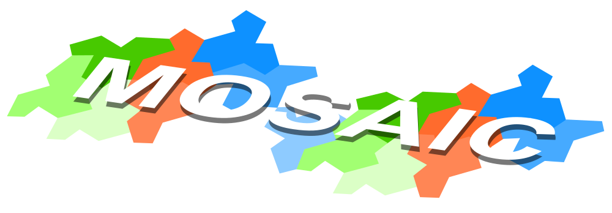

.. _mosaic:

######
Mosaic
######

Mosaic is a Yosys-based synthesis frontend for VTR, it is an alternative to Pamrys and Odin II. It elaborates Verilog, maps inferred operators onto architecture hardblocks, and performs LUT mapping inside Yosys. It is currently under developlment. The name Mosaic refers to the use of templates for layered techmapping and synthesis.

Select Mosaic with ``-start mosaic`` on :ref:`run_vtr_flow`. Parmys remains the default frontend. Mosaic writes a LUT-mapped BLIF (``<circuit>.mosaic.blif``), so the flow skips the external ABC stage and continues into VPR.

The default VTR build includes Mosaic (``WITH_MOSAIC``, default ``ON``). The plugin is installed at ``build/share/yosys/plugins/mosaic.so``.
