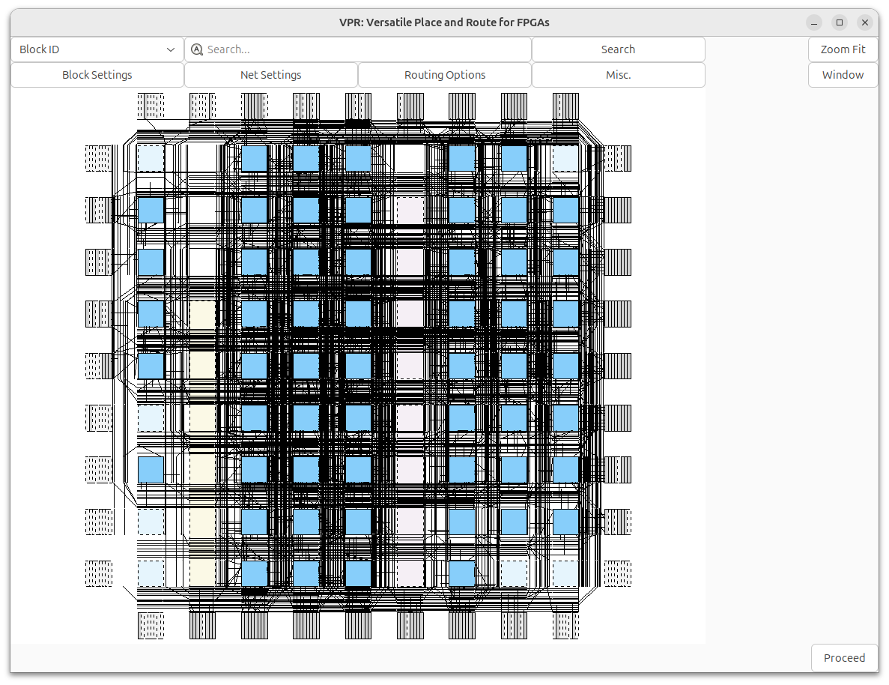
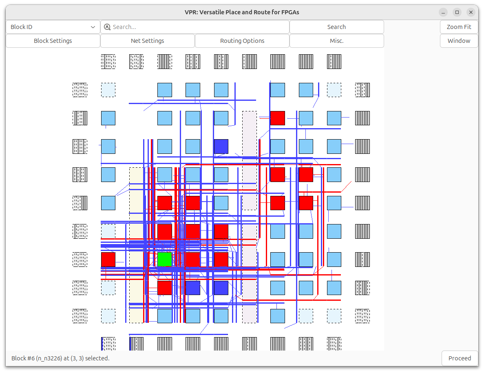
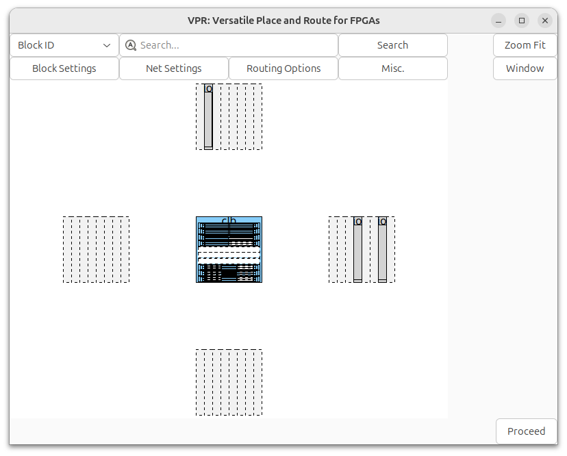

###############
VTR Quick Start
###############

This is a quick introduction to VTR which covers how to run VTR and some of its associated tools (:ref:`VPR`, :ref:`Parmys`, :ref:`ABC`).

Setting Up VTR
==============

Download VTR
------------

The first step is to `download VTR <https://verilogtorouting.org/download/>`_ and extract it on your local machine.

.. note:: Developers planning to modify VTR should clone the `VTR git repository <https://github.com/verilog-to-routing/vtr-verilog-to-routing/>`_.

Environment Setup
-----------------
If you cloned the repository, you will need to set up the git submodules (if you downloaded and extracted a release, you can skip this step):

.. code-block:: bash

    > git submodule init
    > git submodule update
    
VTR requires several system packages and Python packages to build and run the flow.  You can install the required system packages using the following command (this works on Ubuntu 18.04, 20.04 and 22.04, but you may require different packages on other Linux distributions). Our CI testing is on Ubuntu 22.04, so that is the best tested platform and recommended for development.

.. code-block:: bash

    > ./install_apt_packages.sh

Then, to install the required Python packages (optionally within a new Python virtual environment):

.. code-block:: bash

    > make env                          # optional: install python virtual environment
    > source .venv/bin/activate         # optional: activate python virtual environment
    > pip install -r requirements.txt   # install python packages (in virtual environment if prior commands run, system wide otherwise)

Build VTR
---------

On most unix-like systems you can run:

.. code-block:: bash

    > make

.. note:: 

    In the VTR documentation lines starting with ``>`` (like ``> make`` above), indicate a command (i.e. ``make``) to run from your terminal.
    When the ``\`` symbol appears at the end of a line, it indicates line continuation.

.. note::

    :term:`$VTR_ROOT` refers to the root directory of the VTR project source tree.
    To run the examples in this guide on your machine, either:

    * define VTR_ROOT as a variable in your shell (e.g. if ``~/trees/vtr`` is the path to the VTR source tree on your machine, run the equivalent of ``VTR_ROOT=~/trees/vtr`` in BASH) which will allow you to run the commands as written in this guide, or
    * manually replace `$VTR_ROOT` in the example commands below with your path to the VTR source tree.

For more details on building VTR on various operating systems/platforms see :doc:`Building VTR</BUILDING>`.

Running the VTR Flow
----------------------------------
Running each stage of the flow manually is time consuming (and potentially error prone).
For convenience, VTR provides a script (:ref:`run_vtr_flow`) which automates this process.

First, make sure you have activated the Python virtual environment created at the beginning of this tutorial:

.. code-block:: bash

    > source $VTR_ROOT/.venv/bin/activate

Define the working directory where the flow will be executed. For convenience, use an environment variable:

.. code-block:: bash

    export VTR_FLOW_DIR=~/vtr_work/quickstart/blink_run_flow

Alternatively, you can manually replace ``$VTR_FLOW_DIR`` with your preferred directory path in the commands below.

Create the working directory and navigate into it:

.. code-block:: bash

    > mkdir -p $VTR_FLOW_DIR
    > cd $VTR_FLOW_DIR

Now lets run the script (``$VTR_ROOT/vtr_flow/scripts/run_vtr_flow.py``) passing in:

* The circuit verilog file (``$VTR_ROOT/doc/src/quickstart/blink.v``)
* The FPGA architecture file (``$VTR_ROOT/vtr_flow/arch/timing/EArch.xml``)

and also specifying the options:

* ``--route_chan_width 100`` a fixed FPGA routing architecture channel width.

The resulting command is:

.. code-block:: bash

    > $VTR_ROOT/vtr_flow/scripts/run_vtr_flow.py \
        $VTR_ROOT/doc/src/quickstart/blink.v \
        $VTR_ROOT/vtr_flow/arch/timing/EArch.xml \
        --route_chan_width 100

.. note:: Options unrecognized by run_vtr_flow (like ``--route_chan_width``) are passed on to VPR.

which should produce output similar to::

    EArch/blink             OK     (took 0.26 seconds, overall memory peak 63.71 MiB consumed by vpr run)

There are also multiple log files (including for ABC, Parmys and VPR), which by convention the script names with the ``.out`` suffix:

.. code-block:: bash

    > ls $VTR_FLOW_DIR/temp/*.out

    0_blackboxing_latch.out  parmys.out        report_clocks.abc.out  vanilla_restore_clocks.out
    abc0.out                 report_clk.out  restore_latch0.out     vpr.out

With the main log files of interest including the Parmys log file (``parmys.out``), log files produced by ABC (e.g. ``abc0.out``), and the VPR log file (``vpr.out``).

.. note::

    ABC may be invoked multiple times if a circuit has multiple clock domains, producing multiple log files (``abc0.out``, ``abc1.out``, ...)
    

You will also see there are several BLIF files produced:

.. code-block:: bash

    > ls $VTR_FLOW_DIR/temp/*.blif

    0_blink.abc.blif   0_blink.raw.abc.blif  blink.parmys.blif
    0_blink.parmys.blif  blink.abc.blif        blink.pre-vpr.blif

With the main files of interest being ``blink.parmys.blif`` (netlist produced by Parmys), ``blink.abc.blif`` (final netlist produced by ABC after clock restoration), ``blink.pre-vpr.blif`` netlist used by VPR (usually identical to ``blink.abc.blif``).

Like before, we can also see the implementation files generated by VPR:

.. code-block:: bash

    > ls $VTR_FLOW_DIR/temp/*.net $VTR_FLOW_DIR/temp/*.place $VTR_FLOW_DIR/temp/*.route

    blink.net  blink.place  blink.route

which we can visualize with:

.. code-block:: bash

    > $VTR_ROOT/vpr/vpr \
        $VTR_ROOT/vtr_flow/arch/timing/EArch.xml \
        blink --circuit_file $VTR_FLOW_DIR/temp/blink.pre-vpr.blif \
        --route_chan_width 100 \
        --analysis --disp on

Running VPR Manually
===========
Sometimes you may wish to run only the vpr (placement, routing and timing analysis) parts of the flow rather than the full VTR flow (which includes synthesis). To show how to do this, let's now try taking a simple pre-synthesized circuit (consisting of LUTs and Flip-Flops) and use the VPR tool to implement it on a specific FPGA architecture.

Running VPR on a Pre-Synthesized Circuit
----------------------------------------

First, let's make a directory in our home directory where we can work:

.. code-block:: bash

    #Move to our home directory
    > cd ~

    #Make a working directory
    > mkdir -p vtr_work/quickstart/vpr_tseng

    #Move into the working directory
    > cd ~/vtr_work/quickstart/vpr_tseng

Now, lets invoke the VPR tool to implement:

* the ``tseng`` circuit (``$VTR_ROOT/vtr_flow/benchmarks/blif/tseng.blif``), on 
* the ``EArch`` FPGA architecture (``$VTR_ROOT/vtr_flow/arch/timing/EArch.xml``).

We do this by passing these files to the VPR tool, and also specifying that we want to route the circuit on a version of ``EArch`` with a routing architecture :option:`channel width <vpr --route_chan_width>` of ``100`` (``--route_chan_wdith 100``):

.. code-block:: bash

    > $VTR_ROOT/vpr/vpr \
        $VTR_ROOT/vtr_flow/arch/timing/EArch.xml \
        $VTR_ROOT/vtr_flow/benchmarks/blif/tseng.blif \
        --route_chan_width 100

This will produce a large amount of output as VPR implements the circuit, but you should see something similar to::

    VPR FPGA Placement and Routing.
    Version: 8.1.0-dev+2b5807ecf
    Revision: v8.0.0-1821-g2b5807ecf
    Compiled: 2020-05-21T16:39:33
    Compiler: GNU 7.3.0 on Linux-4.15.0-20-generic x86_64
    Build Info: release VTR_ASSERT_LEVEL=2

    University of Toronto
    verilogtorouting.org
    vtr-users@googlegroups.com
    This is free open source code under MIT license.

    #
    #Lots of output trimmed for brevity....
    #

    Geometric mean non-virtual intra-domain period: 6.22409 ns (160.666 MHz)
    Fanout-weighted geomean non-virtual intra-domain period: 6.22409 ns (160.666 MHz)

    VPR suceeded
    The entire flow of VPR took 3.37 seconds (max_rss 40.7 MiB)
    
which shows that VPR as successful (``VPR suceeded``), along with how long VPR took to run (~3 seconds in this case).

You will also see various result files generated by VPR which define the circuit implementation:

.. code-block:: bash

    > ls *.net *.place *.route

    tseng.net  tseng.place  tseng.route

along with a VPR log file which contains what VPR printed when last invoked:

.. code-block:: bash

    > ls *.log

    vpr_stdout.log

and various report files describing the characteristics of the implementation:

.. code-block:: bash

    > ls *.rpt

    packing_pin_util.rpt              report_timing.hold.rpt   report_unconstrained_timing.hold.rpt
    pre_pack.report_timing.setup.rpt  report_timing.setup.rpt  report_unconstrained_timing.setup.rpt

Visualizing Circuit Implementation
-----------------------------------

.. note:: This section requires that VPR was compiled with graphic support. See :ref:`VPR Graphics <vpr_graphics>` for details.

The ``.net``, ``.place`` and ``.route`` files (along with the input ``.blif`` and architecture ``.xml`` files) fully defined the circuit implementation.
We can visualize the circuit implementation by:

* Re-running VPR's analysis stage (:option:`--analysis <vpr --analysis>`), and
* enabling VPR's graphical user interface (:option:`--disp <vpr --disp>` ``on``).
   
This is done by running the following:

.. code-block:: bash

    > $VTR_ROOT/vpr/vpr \
        $VTR_ROOT/vtr_flow/arch/timing/EArch.xml \
        $VTR_ROOT/vtr_flow/benchmarks/blif/tseng.blif \
        --route_chan_width 100 \
        --analysis --disp on

which should open the VPR graphics and allow you to explore the circuit implementation.

As an exercise try the following:

* View the connectivity of a block (connections which drive it, and those which it drives)
* View the internals of a logic block (e.g. try to find the LUTs/``.names`` and Flip-Flops/``.latch``)
* Visualize all the routed circuit connections

.. seealso:: For more details on the various graphics options, see :ref:`VPR Graphics <vpr_graphics>` 

    Routed net connections of ``tseng`` on ``EArch``.

    Input (blue)/output (red) nets of block ``n_n3226`` (highlighted green).

.. note:: 
    If you do not provide :option:`--analysis <vpr --analysis>`, VPR will re-implement the circuit from scratch.
    If you also specify :option:`--disp <vpr --disp>` ``on``, you can see how VPR modifies the implementation as it runs.
    By default ``--disp on`` stops at key stages to allow you to view and explore the implementation.
    You will need to press the ``Proceed`` button in the GUI to allow VPR to continue to the next stage.

Manually Running the VTR Flow
-----------------------------
In the previous section we have implemented a pre-synthesized circuit onto a pre-existing FPGA architecture using VPR, and visualized the result.
We now turn to how we can implement *our own circuit* on a pre-existing FPGA architecture.

To do this, we begin by describing a circuit behaviourally using the Verilog Hardware Description Language (HDL).
This allows us to quickly and consisely define the circuit's behaviour.
We will then use the VTR Flow to synthesize the behavioural Verilog description it into a circuit netlist, and implement it onto an FPGA.

Example Circuit
---------------
We will use the following simple example circuit, which causes its output to toggle on and off:

.. literalinclude:: blink.v
    :language: verilog
    :linenos:
    :emphasize-lines: 10,15,26
    :caption: blink.v (``$VTR_ROOT/doc/src/quickstart/blink.v``)

This Verilog creates a sequential 5-bit register (``r_counter``) which increments every clock cycle.
If the count is below ``16`` it drives the output (``o_led``) high, otherwise it drives it low.

With the circuit defined, we are now ready to move forward with implementing it on an FPGA. To begin the process, we’ll set up a fresh working directory where we can manage our files and run the necessary VTR flow steps. Let’s get started by creating that directory and organizing our workspace:

- ``$WRK_DIR`` will serve as our working directory for this example.

To set this variable, define it in your shell:

.. code-block:: bash

    export WRK_DIR=~/vtr_work/quickstart/blink_manual

Alternatively, manually replace ``$WRK_DIR`` in the example commands with your path.

Now, create and navigate to the working directory:

.. code-block:: bash

    > mkdir -p $WRK_DIR
    > cd $WRK_DIR

Next, we need to run the three main sets of tools, depending on the method of synthesis you choose:

1. **Synthesis Options**:
   
   - **Parmys**: Parmys is the default synthesis tool in the VTR flow.

   - **Odin II**: Odin II is the alternative synthesis tool supported by VTR.

2. **Finally, regardless of the synthesis method**, run :ref:`ABC` to perform logic optimization and technology mapping, and then run :ref:`VPR` to handle packing, placement, and routing, which completes the implementation on the FPGA architecture.

.. _synthesizing_with_parmys:
Synthesizing with Parmys
~~~~~~~~~~~~~~~~~~~~~~~~~

To synthesize our Verilog file into a circuit netlist, we will utilize the `run_vtr_flow.py` script, which streamlines the process. This command synthesizes the provided Verilog file (`blink.v`) while targeting the specified FPGA architecture (`EArch.xml`).

The command is as follows:

.. code-block:: bash

    > $VTR_ROOT/vtr_flow/scripts/run_vtr_flow.py \
        $VTR_ROOT/doc/src/quickstart/blink.v \
        $VTR_ROOT/vtr_flow/arch/timing/EArch.xml \
        -start parmys -end parmys

When executed, the output should indicate successful synthesis, similar to:

.. code-block:: bash

    EArch/blink        OK (took 0.16 seconds, overall memory peak 20.00 MiB consumed by parmys run)

This output confirms that the synthesis was successful and provides information on the duration and memory usage during the process.

We can now take a look at the circuit which Parmys produced (``blink.parmys.blif``).

.. seealso:: For more information on the BLIF file format see :ref:`blif_format`.

Optimizing and Technology Mapping with ABC
~~~~~~~~~~~~~~~~~~~~~~~~~~~~~~~~~~~~~~~~~~

Next, we'll optimize and technology map our circuit using ABC, providing the option:

 * ``-c <script>``, where ``<script>`` is a set of commands telling ABC how to synthesize our circuit.

We'll use the following, simple ABC commands::

    read blink.parmys.blif;                               #Read the circuit synthesized by parmys
    if -K 6;                                            #Technology map to 6 input LUTs (6-LUTs)
    write_hie blink.parmys.blif blink.abc_no_clock.blif   #Write new circuit to blink.abc_no_clock.blif

.. note:: Usually you should use a more complicated script (such as that used by :ref:`run_vtr_flow`) to ensure ABC optitmizes your circuit well.

The corresponding command to run is:

.. code-block:: bash

    > $VTR_ROOT/abc/abc \
        -c "read $WRK_DIR/temp/blink.parmys.blif; if -K 6; write_hie $WRK_DIR/temp/blink.parmys.blif $WRK_DIR/temp/blink.abc_no_clock.blif"

When run, ABC's output should look similar to::

    ABC command line: "read blink.parmys.blif; if -K 6; write_hie blink.parmys.blif blink.abc_no_clock.blif".

    Hierarchy reader converted 6 instances of blackboxes.
    The network was strashed and balanced before FPGA mapping.
    Hierarchy writer reintroduced 6 instances of blackboxes.

If we now inspect the produced BLIF file (``blink.abc_no_clock.blif``) we see that ABC was able to significantly simplify and optimize the circuit's logic (compared to ``blink.parmys.blif``):

.. literalinclude:: blink.abc_no_clock.blif
    :linenos:
    :emphasize-lines: 6-10,13-18,21-38
    :caption: blink.abc_no_clock.blif

ABC has kept the ``.latch`` and ``.subckt adder`` primitives, but has significantly simplified the other logic (``.names``).

However, there is an issue with the above BLIF produced by ABC: the latches (rising edge Flip-Flops) do not have any clocks or edge sensitivity specified, which is information required by VPR.

Re-inserting clocks
^^^^^^^^^^^^^^^^^^^
We will restore the clock information by running a script which will transfer that information from the original parmys BLIF file (writing it to the new file ``blink.pre-vpr.blif``):

.. code-block:: bash

    > $VTR_ROOT/vtr_flow/scripts/restore_multiclock_latch.pl \
        $WRK_DIR/temp/blink.parmys.blif \
        $WRK_DIR/temp/blink.abc_no_clock.blif \
        $WRK_DIR/temp/blink.pre-vpr.blif

If we inspect ``blink.pre-vpr.blif`` we now see that the clock (``blink^clk``) has been restored to the Flip-Flops:

.. code-block:: bash

    > grep 'latch' blink.pre-vpr.blif

    .latch n19 blink^r_counter~0_FF re blink^clk 3
    .latch n24 blink^r_counter~4_FF re blink^clk 3
    .latch n29 blink^r_counter~3_FF re blink^clk 3
    .latch n34 blink^r_counter~2_FF re blink^clk 3
    .latch n39 blink^r_counter~1_FF re blink^clk 3

Implementing the circuit with VPR
~~~~~~~~~~~~~~~~~~~~~~~~~~~~~~~~~
Now that we have the optimized and technology mapped netlist (``blink.pre-vpr.blif``), we can invoke VPR to implement it onto the ``EArch`` FPGA architecture (in the same way we did with the ``tseng`` design earlier).
However, since our BLIF file doesn't match the design name we explicitly specify:

 * ``blink`` as the circuit name, and
 * the input circuit file with :option:`--circuit_file <vpr --circuit_file>`.

to ensure the resulting ``.net``, ``.place`` and ``.route`` files will have the correct names.

The resulting command is:

.. code-block:: bash

    > $VTR_ROOT/vpr/vpr \
        $VTR_ROOT/vtr_flow/arch/timing/EArch.xml \
        blink --circuit_file $WRK_DIR/temp/blink.pre-vpr.blif \
        --route_chan_width 100

and after VPR finishes we should see the resulting implementation files:

.. code-block:: bash

    > ls $WRK_DIR/*.net $WRK_DIR/*.place $WRK_DIR/*.route

    blink.net  blink.place  blink.route

We can then view the implementation as usual by appending ``--analysis --disp on`` to the command:

.. code-block:: bash

    > $VTR_ROOT/vpr/vpr \
        $VTR_ROOT/vtr_flow/arch/timing/EArch.xml \
        blink --circuit_file $WRK_DIR/temp/blink.pre-vpr.blif \
        --route_chan_width 100 \
        --analysis --disp on

    ``blink.v`` circuit implementation on the ``EArch`` FPGA architecture as viewed in the VPR GUI

Manually Running VTR with ODIN II
----------------------------------
VTR includes a second synthesis tool, ODIN II. Below we explain how to run this alternative synthesis flow.

To synthesize your Verilog design with ODIN II, you need to build VTR with the following command:

.. code-block:: bash

    > cd ~/$VTR_ROOT
    > make CMAKE_PARAMS="-DWITH_ODIN=on"

This step enables ODIN II support in the VTR build process, which is essential for the subsequent synthesis operations.

Lets make a new directory for us to work in:

.. code-block:: bash

    > mkdir -p ~/vtr_work/quickstart/blink_manual
    > cd ~/vtr_work/quickstart/blink_manual

Next, run ODIN II on your Verilog file to synthesize it into a circuit netlist. Use the command below, specifying the required options:

 * ``-a $VTR_ROOT/vtr_flow/arch/timing/EArch.xml`` which specifies what FPGA architecture we are targeting,
 * ``-V $VTR_ROOT/doc/src/quickstart/blink.v`` which specifies the verilog file we want to synthesize, and
 * ``-o blink.odin.blif`` which specifies the name of the generated ``.blif`` circuit netlist.

The resulting command is:

.. code-block:: bash

    > $VTR_ROOT/odin_ii/odin_ii \
        -a $VTR_ROOT/vtr_flow/arch/timing/EArch.xml \
        -V $VTR_ROOT/doc/src/quickstart/blink.v \
        -o blink.odin.blif

After running the command, you should see an output similar to the following::

    Total time: 14.7ms
    Odin ran with exit status: 0
    Odin II took 0.01 seconds (max_rss 5.1 MiB)

where ``Odin ran with exit status: 0`` indicates Odin successfully synthesized our verilog.

We can now take a look at the circuit which ODIN produced (``blink.odin.blif``).
The file is long and likely harder to follow than our code in ``blink.v``; however it implements the same functionality.
Some interesting highlights are shown below:

.. literalinclude:: blink.odin.blif
    :lines: 14,40
    :caption: Instantiations of rising-edge triggered Latches (i.e. Flip-Flops) in ``blink.odin.blif`` (implements part of ``r_counter`` in blink.v)

.. literalinclude:: blink.odin.blif
    :lines: 17-19,21-22
    :caption: Adder primitive instantiations in ``blink.odin.blif``, used to perform addition (implements part of the ``+`` operator in blink.v)

.. literalinclude:: blink.odin.blif
    :lines: 45-50
    :caption: Logic equation (.names truth-table) in ``blink.odin.blif``, implementing logical OR (implements part of the ``<`` operator in blink.v)

.. seealso:: For more information on the BLIF file format see :ref:`blif_format`.

After generating ``blink.odin.blif``, we can proceed to optimize the netlist and implement it on the FPGA. Follow the steps outlined in the section titled :ref:`Optimizing and Technology Mapping with ABC`, using the generated ``blink.odin.blif`` as input instead of ``blink.parmys.blif``. 

Once the netlist is optimized with ABC, continue with the :ref:`Implementing the circuit with VPR` section to pack, place, and route the circuit onto the FPGA architecture.

Next Steps
==========
Now that you've finished the VTR quickstart, you're ready to start experimenting and using VTR.

Here are some possible next steps for users wishing to use VTR:

 * Try modifying the Verilog file (e.g. ``blink.v``) or make your own circuit and try running it through the flow.

 * Learn about FPGA architecture modelling (:ref:`Tutorials <arch_tutorial>`, :ref:`Reference <fpga_architecture_description>`), and try modifying a copy of ``EArch`` to see how it changes the implementation of ``blink.v``.

 * Read more about the :ref:`VTR CAD Flow <vtr_cad_flow>`, and :ref:`Task <vtr_tasks>` automation framework.

 * Find out more about using other benchmark sets, like how to run the :ref:`Titan Benchmark Suite <titan_benchmarks_tutorial>`.

 * Discover how to :ref:`generate FASM <genfasm>` for bitstream creation.

 * :doc:`Suggest or make enhancements to VTR's documentation </CONTRIBUTING>`.

Here are some possible next steps for developers wishing to modify and improve VTR:

 * Try the next steps listed for users above to learn how VTR is used.

 * Work through the :ref:`new developer tutorial <new_developer_tutorial>`.

 * Read through the :ref:`developer guide <developer_guide>`.

 * Look for :doc:`open issues to which you can contribute </CONTRIBUTING>`.

 * Begin exploring the source code for the main tools in VTR (e.g. VPR in ``$VTR_ROOT/vpr/src``).
