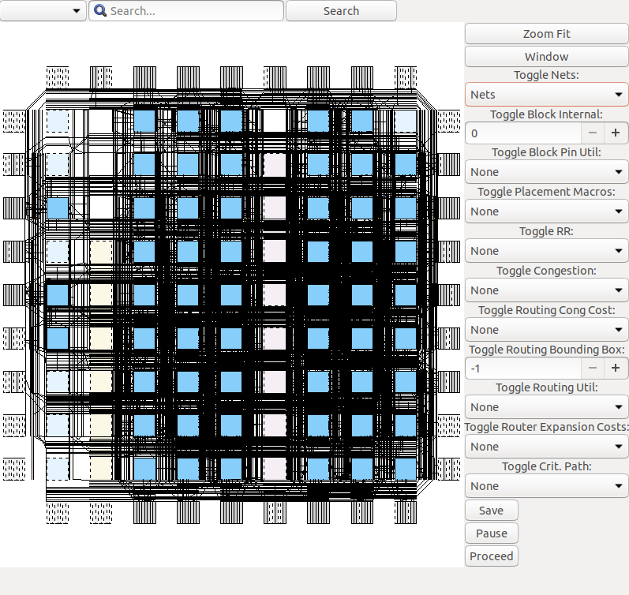
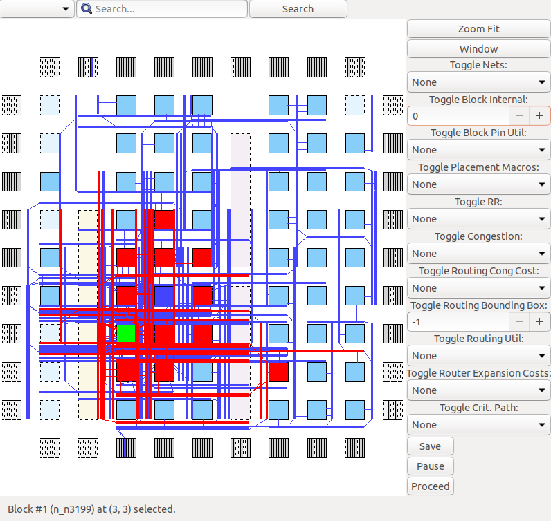
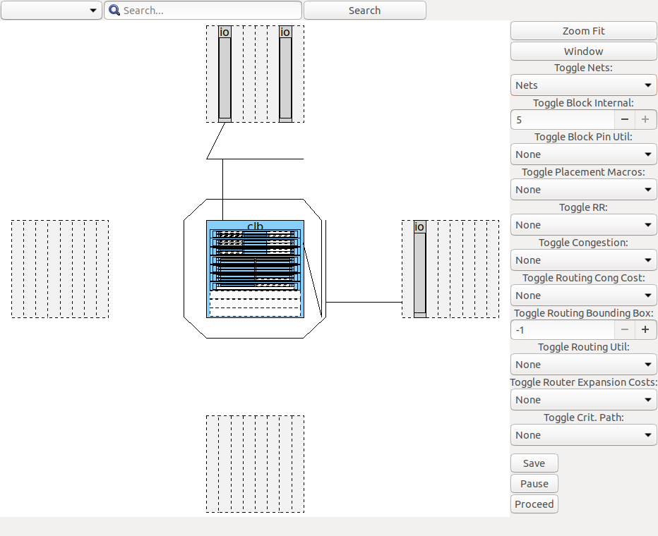

###############
VTR Quick Start
###############

This is a quick introduction to VTR which covers how to run VTR and some if its associated tools (:ref:`VPR`, :ref:`odin_II`, :ref:`ABC`).

Setting Up VTR
==============

Download VTR
------------

The first step is to `download VTR <https://verilogtorouting.org/download/>`_ and extract VTR on your local machine.

.. note:: Developers planning to modify VTR should clone the `VTR git repository <https://github.com/verilog-to-routing/vtr-verilog-to-routing/>`_.

Build VTR
---------

On most unix-like systems you can run:

.. code-block:: bash

    > make

from the VTR root directory (hereafter referred to as :term:`$VTR_ROOT`) to build VTR.

.. note:: 

    In the VTR documentation lines starting with ``>`` (like ``> make`` above), indicate a command (i.e. ``make``) to run from your terminal.
    When the ``\`` symbol appears at the end of a line, it indicates line continuation.

.. note::

    :term:`$VTR_ROOT` refers to the root directory of the VTR project source tree.
    To run the examples in this guide on your machine, either:

    * define VTR_ROOT as a variable in your shell (e.g. if ``~/trees/vtr`` is the path to the VTR source tree on your machine, run the equivalent of ``VTR_ROOT=~/trees/vtr`` in BASH) which will allow you to run the commands as written in this guide, or
    * manually replace `$VTR_ROOT` in the example commandss below with your path to the VTR source tree.

.. note:: If VTR fails to build you may need to install the :ref:`required dependencies <building_vtr>`.

For more details on building VTR on various operating systems/platforms see :ref:`Building VTR<building_vtr>`.

Running VPR
===========

Lets now try taking a simple pre-synthesized circuit (consisting of LUTs and Flip-Flops) and use the VPR tool to implement it on a specific FPGA architecture.

Running VPR on a Pre-Synthesized Circuit
----------------------------------------

First, lets make a directory in our home directory where we can work:

.. code-block:: bash

    #Move to our home directory
    > cd ~

    #Make a working directory
    > mkdir -p vtr_work/quickstart/vpr_tseng

    #Move into the working directory
    > cd ~/vtr_work/quickstart/vpr_tseng

Now, lets invoke the VPR tool to implement:

* the ``tseng`` circuit (``$VTR_ROOT/vtr_flow/benchmarks/blif/tseng.blif``), on 
* the ``EArch`` FPGA architecture (``$VTR_ROOT/vtr_flow/arch/timing/EArch.xml``).

We do this by passing these files to the VPR tool, and also specifying that we want to route the circuit on a version of ``EArch`` with a routing architecture :option:`channel width <vpr --route_chan_width>` of ``100`` (``--route_chan_wdith 100``):

.. code-block:: bash

    > $VTR_ROOT/vpr/vpr \
        $VTR_ROOT/vtr_flow/arch/timing/EArch.xml \
        $VTR_ROOT/vtr_flow/benchmarks/blif/tseng.blif \
        --route_chan_width 100

This will produce a large amount of output as VPR implements the circuit, but you should see something similar to::

    VPR FPGA Placement and Routing.
    Version: 8.1.0-dev+2b5807ecf
    Revision: v8.0.0-1821-g2b5807ecf
    Compiled: 2020-05-21T16:39:33
    Compiler: GNU 7.3.0 on Linux-4.15.0-20-generic x86_64
    Build Info: release VTR_ASSERT_LEVEL=2

    University of Toronto
    verilogtorouting.org
    vtr-users@googlegroups.com
    This is free open source code under MIT license.

    #
    #Lots of output trimmed for brevity....
    #

    Geometric mean non-virtual intra-domain period: 6.22409 ns (160.666 MHz)
    Fanout-weighted geomean non-virtual intra-domain period: 6.22409 ns (160.666 MHz)

    VPR suceeded
    The entire flow of VPR took 3.37 seconds (max_rss 40.7 MiB)
    
which shows that VPR as successful (``VPR suceeded``), along with how long VPR took to run (~3 seconds in this case).

You will also see various result files generated by VPR which define the circuit implementation:

.. code-block:: bash

    > ls *.net *.place *.route

    tseng.net  tseng.place  tseng.route

along with a VPR log file which contains what VPR printed when last invoked:

.. code-block:: bash

    > ls *.log

    vpr_stdout.log

and various report files describing the characteristics of the implementation:

.. code-block:: bash

    > ls *.rpt

    packing_pin_util.rpt              report_timing.hold.rpt   report_unconstrained_timing.hold.rpt
    pre_pack.report_timing.setup.rpt  report_timing.setup.rpt  report_unconstrained_timing.setup.rpt

Visualizing Circuit Implementation
-----------------------------------

.. note:: This section requires that VPR was compiled with graphic support. See :ref:`VPR Graphics <vpr_graphics>` for details.

The ``.net``, ``.place`` and ``.route`` files (along with the input ``.blif`` and architecture ``.xml`` files) fully defined the circuit implementation.
We can visualize the circuit implementation by:

* Re-running VPR's analysis stage (:option:`--analysis <vpr --analysis>`), and
* enabling VPR's graphical user interface (:option:`--disp <vpr --disp>` ``on``).
   
This is done by running the following:

.. code-block:: bash

    > $VTR_ROOT/vpr/vpr \
        $VTR_ROOT/vtr_flow/arch/timing/EArch.xml \
        $VTR_ROOT/vtr_flow/benchmarks/blif/tseng.blif \
        --route_chan_width 100 \
        --analysis --disp on

which should open the VPR graphics and allow you to explore the circuit implementation.

As an exercise try the following:

* View the connectivity of a block (connections which drive it, and those which it drives)
* View the internals of a logic block (e.g. try to find the LUTs/``.names`` and Flip-Flops/``.latch``)
* Visualize all the routed circuit connections

.. seealso:: For more details on the various graphics options, see :ref:`VPR Graphics <vpr_graphics>` 

    Routed net connections of ``tseng`` on ``EArch``.

    Input (blue)/output (red) nets of block ``n_n3199`` (highlighted green).

.. note:: 
    If you do not provide :option:`--analysis <vpr --analysis>`, VPR will re-implement the circuit from scratch.
    If you also specify :option:`--disp <vpr --disp>` ``on``, you can see how VPR modifies the implementation as it runs.
    By default ``--disp on`` stops at key stages to allow you to view and explore the implementation.
    You will need to press the ``Proceed`` button in the GUI to allow VPR to continue to the next stage.

Running the VTR Flow
====================
In the previous section we have implemented a pre-synthesized circuit onto a pre-existing FPGA architecture using VPR, and visualized the result.
We now turn to how we can implement *our own circuit* on a pre-existing FPGA architecture.

To do this we begin by describing a circuit behaviourly using the Verilog Hardware Description Language (HDL).
This allows us to quickly and consisely define the circuit's behaviour.
We will then use the VTR Flow to synthesize the behavioural Verilog description it into a circuit netlist, and implement it onto an FPGA.

Example Circuit
---------------
We will use the following simple example circuit, which causes it's output to toggle on and off:

.. literalinclude:: blink.v
    :language: verilog
    :linenos:
    :emphasize-lines: 10,15,26
    :caption: blink.v (``$VTR_ROOT/doc/src/quickstart/blink.v``)

This Verilog creates a sequential 5-bit register (``r_counter``) which increments every clock cycle.
If the count is below ``16`` it drives the output (``o_led``) high, otherwise it drives it low.

Manually Running the VTR Flow
-----------------------------
Lets start by making a fresh directory for us to work in:

.. code-block:: bash

    > mkdir -p ~/vtr_work/quickstart/blink_manual
    > cd ~/vtr_work/quickstart/blink_manual

Next we need to run the three main sets of tools:

* :ref:`odin_II` performs 'synthesis' which converts our behavioural Verilog (``.v`` file) into a circuit netlist (``.blif`` file) consisting of logic equations and FPGA architecture primitives (Flip-Flops, adders etc.),
* :ref:`ABC` performs 'logic optimization' which simplifies the circuit logic, and 'technology mapping' which converts logic equations into the Look-Up-Tables (LUTs) available on an FPGA, and
* :ref:`VPR` which performs packing, placement and routing of the circuit to implement it on the targetted FPGA architecture.

Synthesizing with ODIN II
~~~~~~~~~~~~~~~~~~~~~~~~~

First we'll run ODIN II on our Verilog file to synthesize it into a circuit netlist, providing the options:

 * ``-a $VTR_ROOT/vtr_flow/arch/timing/EArch.xml`` which specifies what FPGA architecture we are targetting,
 * ``-V $VTR_ROOT/doc/src/quickstart/blink.v`` which specifies the verilog file we want to synthesize, and
 * ``-o blink.odin.blif`` which specifies the name of the generated ``.blif`` circuit netlist.

The resulting command is:

.. code-block:: bash

    > $VTR_ROOT/ODIN_II/odin_II \
        -a $VTR_ROOT/vtr_flow/arch/timing/EArch.xml \
        -V $VTR_ROOT/doc/src/quickstart/blink.v \
        -o blink.odin.blif

which when run should end with something like::

    Total time: 14.7ms
    Odin ran with exit status: 0
    Odin II took 0.01 seconds (max_rss 5.1 MiB)

where ``Odin ran with exit status: 0`` indicates Odin successfully synthesized our verilog.

We can now take a look at the circuit which ODIN produced (``blink.odin.blif``).
The file is long and likely harder to follow than our code in ``blink.v``; however it implements the same functionality.
Some interesting highlights are shown below:

.. literalinclude:: blink.odin.blif
    :lines: 14,40
    :caption: Instantiations of rising-edge triggered Latches (i.e. Flip-Flops) in ``blink.odin.blif`` (implements part of ``r_counter`` in blink.v)

.. literalinclude:: blink.odin.blif
    :lines: 17-19,21-22
    :caption: Adder primitive instantiations in ``blink.odin.blif``, used to perform addition (implements part of the ``+`` operator in blink.v)

.. literalinclude:: blink.odin.blif
    :lines: 45-50
    :caption: Logic equation (.names truth-table) in ``blink.odin.blif``, implementing logical OR (implements part of the ``<`` operator in blink.v)

.. seealso:: For more information on the BLIF file format see :ref:`blif_format`.

Optimizing and Technology Mapping with ABC
~~~~~~~~~~~~~~~~~~~~~~~~~~~~~~~~~~~~~~~~~~

Next, we'll optimize and technology map our circuit using ABC, providing the option:

 * ``-c <script>``, where ``<script>`` is a set of commands telling ABC how to synthesize our circuit.

We'll use the following, simple ABC commands::

    read blink.odin.blif;                               #Read the circuit synthesized by ODIN
    if -K 6;                                            #Technology map to 6 input LUTs (6-LUTs)
    write_hie blink.odin.blif blink.abc_no_clock.blif   #Write new circuit to blink.abc_no_clock.blif

.. note:: Usually you should use a more complicated script (such as that used by :ref:`run_vtr_flow`) to ensure ABC optitmizes your circuit well.

The corresponding command to run is:

.. code-block:: bash

    > $VTR_ROOT/abc/abc \
        -c 'read blink.odin.blif; if -K 6; write_hie blink.odin.blif blink.abc_no_clock.blif'

When run, ABC's output should look similar to::

    ABC command line: "read blink.odin.blif; if -K 6; write_hie blink.odin.blif blink.abc_no_clock.blif".

    Hierarchy reader converted 6 instances of blackboxes.
    The network was strashed and balanced before FPGA mapping.
    Hierarchy writer reintroduced 6 instances of blackboxes.

If we now inspect the produced BLIF file (``blink.abc_no_clock.blif``) we see that ABC was able to significantly simplify and optimize the circuit's logic (compared to ``blink.odin.blif``):

.. literalinclude:: blink.abc_no_clock.blif
    :linenos:
    :emphasize-lines: 6-10,13-18,21-38
    :caption: blink.abc_no_clock.blif

ABC has kept the ``.latch`` and ``.subckt adder`` primitives, but has significantly simplified the other logic (``.names``).

However, there is an issue with the above BLIF produced by ABC: the latches (rising edge Flip-Flops) do not have any clocks or edge sensitivity specified, which is information required by VPR.

Re-inserting clocks
^^^^^^^^^^^^^^^^^^^
We will restore the clock information by running a script which will transfer that information from the original ODIN BLIF file (writing it to the new file ``blink.pre-vpr.blif``):

.. code-block:: bash

    > $VTR_ROOT/vtr_flow/scripts/restore_multiclock_latch.pl \
        blink.odin.blif \
        blink.abc_no_clock.blif \
        blink.pre-vpr.blif

If we inspect ``blink.pre-vpr.blif`` we now see that the clock (``blink^clk``) has been restored to the Flip-Flops:

.. code-block:: bash

    > grep 'latch' blink.pre-vpr.blif

    .latch n19 blink^r_counter~0_FF re blink^clk 3
    .latch n24 blink^r_counter~4_FF re blink^clk 3
    .latch n29 blink^r_counter~3_FF re blink^clk 3
    .latch n34 blink^r_counter~2_FF re blink^clk 3
    .latch n39 blink^r_counter~1_FF re blink^clk 3

Implementing the circuit with VPR
~~~~~~~~~~~~~~~~~~~~~~~~~~~~~~~~~
Now that we have the optimized and technology mapped netlist (``blink.pre-vpr.blif``), we can invoke VPR to implement it onto the ``EArch`` FPGA architecture (in the same way we did with the ``tseng`` design earlier).
However, since our BLIF file doesn't match the design name we explicitly specify:

 * ``blink`` as the circuit name, and
 * the input circuit file with :option:`--circuit_file <vpr --circuit_file>`.

to ensure the resulting ``.net``, ``.place`` and ``.route`` files will have the correct names.

The resulting command is:

.. code-block:: bash

    > $VTR_ROOT/vpr/vpr \
        $VTR_ROOT/vtr_flow/arch/timing/EArch.xml \
        blink --circuit_file blink.pre-vpr.blif \
        --route_chan_width 100

and after VPR finishes we should see the resulting implementation files:

.. code-block:: bash

    > ls *.net *.place *.route

    blink.net  blink.place  blink.route

We can then view the implementation as usual by appending ``--analysis --disp on`` to the command:

.. code-block:: bash

    > $VTR_ROOT/vpr/vpr \
        $VTR_ROOT/vtr_flow/arch/timing/EArch.xml \
        blink --circuit_file blink.pre-vpr.blif \
        --route_chan_width 100 \
        --analysis --disp on

    ``blink.v`` circuit implementation on the ``EArch`` FPGA architecture as viewed in the VPR GUI

Automatically Running the VTR Flow
----------------------------------
Running each stage of the flow manually is time consuming (and potentially error prone).
For convenience, VTR provides a script (:ref:`run_vtr_flow`) which automates this process.

Lets make a new directory to work in named ``blink_run_flow``:

.. code-block:: bash

    > mkdir -p ~/vtr_work/quickstart/blink_run_flow
    > cd ~/vtr_work/quickstart/blink_run_flow

Now lets run the script (``$VTR_ROOT/vtr_flow/scripts/run_vtr_flow.py``) passing in:

* The circuit verilog file (``$VTR_ROOT/doc/src/quickstart/blink.v``)
* The FPGA architecture file (``$VTR_ROOT/vtr_flow/arch/timing/EArch.xml``)

and also specifying the options:

* ``-temp_dir .`` to run in the current directory (``.`` on unix-like systems)
* ``--route_chan_width 100`` a fixed FPGA routing architecture channel width.

The resulting command is:

.. code-block:: bash

    > $VTR_ROOT/vtr_flow/scripts/run_vtr_flow.py \
        $VTR_ROOT/doc/src/quickstart/blink.v \
        $VTR_ROOT/vtr_flow/arch/timing/EArch.xml \
        -temp_dir . \
        --route_chan_width 100

.. note:: Options unrecognized by run_vtr_flow (like ``--route_chan_width``) are passed on to VPR.

which should produce output similar to::

    EArch/blink             OK     (took 0.26 seconds)

There are also multiple log files (including for ABC, ODIN and VPR), which by convention the script names with the ``.out`` suffix:

.. code-block:: bash

    > ls *.out

    0_blackboxing_latch.out  odin.out        report_clocks.abc.out  vanilla_restore_clocks.out
    abc0.out                 report_clk.out  restore_latch0.out     vpr.out

With the main log files of interest including the ODIN log file (``odin.out``), log files produced by ABC (e.g. ``abc0.out``), and the VPR log file (``vpr.out``).

.. note::

    ABC may be invoked multiple times if a circuit has multiple clock domains, producing multiple log files (``abc0.out``, ``abc1.out``, ...)
    

You will also see there are several BLIF files produced:

.. code-block:: bash

    > ls *.blif

    0_blink.abc.blif   0_blink.raw.abc.blif  blink.odin.blif
    0_blink.odin.blif  blink.abc.blif        blink.pre-vpr.blif

With the main files of interest being ``blink.odin.blif`` (netlist produced by ODIN), ``blink.abc.blif`` (final netlist produced by ABC after clock restoration), ``blink.pre-vpr.blif`` netlist used by VPR (usually identical to ``blink.abc.blif``).

Like before, we can also see the implementation files generated by VPR:

.. code-block:: bash

    > ls *.net *.place *.route

    blink.net  blink.place  blink.route

which we can visualize with:

.. code-block:: bash

    > $VTR_ROOT/vpr/vpr \
        $VTR_ROOT/vtr_flow/arch/timing/EArch.xml \
        blink --circuit_file blink.pre-vpr.blif \
        --route_chan_width 100 \
        --analysis --disp on

Next Steps
==========
Now that you've finished the VTR quickstart, you're ready to start experimenting and using VTR.

Here are some possible next steps for users wishing to use VTR:

 * Try modifying the Verilog file (e.g. ``blink.v``) or make your own circuit and try running it through the flow.

 * Learn about FPGA architecture modelling (:ref:`Tutorials <arch_tutorial>`, :ref:`Reference <fpga_architecture_description>`), and try modifying a copy of ``EArch`` to see how it changes the implementation of ``blink.v``.

 * Read more about the :ref:`VTR CAD Flow <vtr_cad_flow>`, and :ref:`Task <vtr_tasks>` automation framework.

 * Find out more about using other benchmark sets, like how to run the :ref:`Titan Benchmark Suite <titan_benchmarks_tutorial>`.

 * Discover how to :ref:`generate FASM <genfasm>` for bitstream creation.

 * :ref:`Suggest or make enhancements to VTR's documentation <contribution_guidelines>`.

Here are some possible next steps for developers wishing to modify and improve VTR:

 * Try the next steps listed for users above to learn how VTR is used.

 * Work through the :ref:`new developer tutorial <new_developer_tutorial>`.

 * Read through the :ref:`developer guide <developer_guide>`.

 * Look for :ref:`open issues to which you can contribute <contribution_guidelines>`.

 * Begin exploring the source code for the main tools in VTR (e.g. VPR in ``$VTR_ROOT/vpr/src``).
