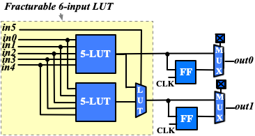
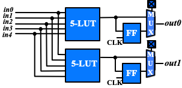

.. _multi_mode_logic_block_tutorial:

Multi-mode Logic Block Tutorial
===============================

This tutorial aims to introduce how to build a representative multi-mode logic block by exploiting VPR architecture description language, as well as debugging tips to guarantee each mode of a logic block is functional.

Definition
----------

Modern FPGA logic blocks are designed to operate in various modes, so as to provide best performance for different applications.
VPR offers enriched syntax to support highly flexible multi-mode logic block architecture.

:numref:`fig_frac_lut_le` shows the physical implemenation of a Fracturable Logic Element (FLE), which consists of a fracturable 6-input Look-Up Table (LUT), two Flip-flops (FFs) and routing multiplexers to select between combinational and sequential outputs.

.. _fig_frac_lut_le:

   
   Schematic of a fracturable logic element

The FLE in :numref:`fig_frac_lut_le` can operate in two different modes: (a) dual 5-input LUT mode (see :numref:`fig_frac_lut_le_dual_lut5_mode`); and (b) single 6-input LUT mode (see :numref:`fig_frac_lut_le_lut6_mode`). Note that each operating mode does not change the physical implementation of FLE but uses part of the programmable resources.

.. _fig_frac_lut_le_dual_lut5_mode:

   
   Simplified organization when the FLE in :numref:`fig_frac_lut_le` operates in dual 5-input LUT mode

.. _fig_frac_lut_le_lut6_mode:

   
   Simplified organization when the FLE in :numref:`fig_frac_lut_le` operates in 6-input LUT mode

Architecture Description
------------------------

To accurately model the operating modes of the FLE, we will use the syntax ``<pb_type>`` and ``<mode>`` in architecture description language.

.. code-block:: xml

   <!-- Multi-mode Fracturable Logic Element definition begin -->
   <pb_type name="fle" num_pb="10">
     <input name="in" num_pins="6"/>
     <output name="out" num_pins="2"/>
     <clock name="clk" num_pins="1"/>

     <!-- Dual 5-input LUT mode definition begin -->
     <mode name="n2_lut5">
       <!-- Detailed definition of the dual 5-input LUT mode -->
     </mode>     
     <!-- Dual 5-input LUT mode definition end -->

     <!-- 6-input LUT mode definition begin -->
     <mode name="n1_lut6">
       <!-- Detailed definition of the 6-input LUT mode -->
     </mode>     
     <!-- 6-input LUT mode definition end -->
   </pb_type>

In the above XML codes, we define a ``<pb_type>`` for the FLE by following the port organization in :numref:`fig_frac_lut_le`.
Under the ``<pb_type>``, we create two modes, ``n2_lut5`` and ``n1_lut6``, corresponding to the two operating modes as shown in :numref:`fig_frac_lut_le_dual_lut5_mode` and :numref:`fig_frac_lut_le_lut6_mode`.
Note that we focus on operating modes here, which are sufficient to perform architecture evaluation.

Under the dual 5-input LUT mode, we can define ``<pb_type>`` and ``<interconnect>`` to model the schematic in :numref:`fig_frac_lut_le_dual_lut5_mode`.

.. code-block:: xml

   <!-- Dual 5-input LUT mode definition begin -->
   <mode name="n2_lut5">
     <pb_type name="lut5inter" num_pb="1">
       <input name="in" num_pins="5"/>
       <output name="out" num_pins="2"/>
       <clock name="clk" num_pins="1"/>
       <!-- Define two LUT5 + FF pairs (num_pb=2) corresponding to :numref:`fig_frac_lut_le_dual_lut5_mode` -->
       <pb_type name="ble5" num_pb="2">
         <input name="in" num_pins="5"/>
         <output name="out" num_pins="1"/>
         <clock name="clk" num_pins="1"/>
         <!-- Define the LUT -->
         <pb_type name="lut5" blif_model=".names" num_pb="1" class="lut">
           <input name="in" num_pins="5" port_class="lut_in"/>
           <output name="out" num_pins="1" port_class="lut_out"/>
           <!-- LUT timing using delay matrix -->
           <!-- These are the physical delay inputs on a Stratix IV LUT but because VPR cannot do LUT rebalancing,
                      we instead take the average of these numbers to get more stable results
                 82e-12
                 173e-12
                 261e-12
                 263e-12
                 398e-12
                 -->
           <delay_matrix type="max" in_port="lut5.in" out_port="lut5.out">
             235e-12
             235e-12
             235e-12
             235e-12
             235e-12
           </delay_matrix>
         </pb_type>
         <!-- Define the flip-flop -->
         <pb_type name="ff" blif_model=".latch" num_pb="1" class="flipflop">
           <input name="D" num_pins="1" port_class="D"/>
           <output name="Q" num_pins="1" port_class="Q"/>
           <clock name="clk" num_pins="1" port_class="clock"/>
           <T_setup value="66e-12" port="ff.D" clock="clk"/>
           <T_clock_to_Q max="124e-12" port="ff.Q" clock="clk"/>
         </pb_type>
         <interconnect>
           <direct name="direct1" input="ble5.in[4:0]" output="lut5[0:0].in[4:0]"/>
           <direct name="direct2" input="lut5[0:0].out" output="ff[0:0].D">
             <!-- Advanced user option that tells CAD tool to find LUT+FF pairs in netlist -->
             <pack_pattern name="ble5" in_port="lut5[0:0].out" out_port="ff[0:0].D"/>
           </direct>
           <direct name="direct3" input="ble5.clk" output="ff[0:0].clk"/>
           <mux name="mux1" input="ff[0:0].Q lut5.out[0:0]" output="ble5.out[0:0]">
             <!-- LUT to output is faster than FF to output on a Stratix IV -->
             <delay_constant max="25e-12" in_port="lut5.out[0:0]" out_port="ble5.out[0:0]"/>
             <delay_constant max="45e-12" in_port="ff[0:0].Q" out_port="ble5.out[0:0]"/>
           </mux>
         </interconnect>
       </pb_type>
       <interconnect>
         <direct name="direct1" input="lut5inter.in" output="ble5[0:0].in"/>
         <direct name="direct2" input="lut5inter.in" output="ble5[1:1].in"/>
         <direct name="direct3" input="ble5[1:0].out" output="lut5inter.out"/>
         <complete name="complete1" input="lut5inter.clk" output="ble5[1:0].clk"/>
       </interconnect>
     </pb_type>
     <interconnect>
       <direct name="direct1" input="fle.in[4:0]" output="lut5inter.in"/>
       <direct name="direct2" input="lut5inter.out" output="fle.out"/>
       <direct name="direct3" input="fle.clk" output="lut5inter.clk"/>
     </interconnect>
   </mode>
   <!-- Dual 5-input LUT mode definition end -->

Under the 6-input LUT mode, we can define ``<pb_type>`` and ``<interconnect>`` to model the schematic in :numref:`fig_frac_lut_le_lut6_mode`.

.. code-block:: xml

   <!-- 6-LUT mode definition begin -->
   <mode name="n1_lut6" disable_packing="false">
     <!-- Define 6-LUT mode, consisting of a LUT6 + FF pair (num_pb=1) corresponding to :numref:`fig_frac_lut_le_lut6_mode`-->
     <pb_type name="ble6" num_pb="1">
       <input name="in" num_pins="6"/>
       <output name="out" num_pins="1"/>
       <clock name="clk" num_pins="1"/>
       <!-- Define LUT -->
       <pb_type name="lut6" blif_model=".names" num_pb="1" class="lut">
         <input name="in" num_pins="6" port_class="lut_in"/>
         <output name="out" num_pins="1" port_class="lut_out"/>
         <!-- LUT timing using delay matrix -->
         <!-- These are the physical delay inputs on a Stratix IV LUT but because VPR cannot do LUT rebalancing,
                  we instead take the average of these numbers to get more stable results
             82e-12
             173e-12
             261e-12
             263e-12
             398e-12
             397e-12
             -->
         <delay_matrix type="max" in_port="lut6.in" out_port="lut6.out">
           261e-12
           261e-12
           261e-12
           261e-12
           261e-12
           261e-12
         </delay_matrix>
       </pb_type>
       <!-- Define flip-flop -->
       <pb_type name="ff" blif_model=".latch" num_pb="1" class="flipflop">
         <input name="D" num_pins="1" port_class="D"/>
         <output name="Q" num_pins="1" port_class="Q"/>
         <clock name="clk" num_pins="1" port_class="clock"/>
         <T_setup value="66e-12" port="ff.D" clock="clk"/>
         <T_clock_to_Q max="124e-12" port="ff.Q" clock="clk"/>
       </pb_type>
       <interconnect>
         <direct name="direct1" input="ble6.in" output="lut6[0:0].in"/>
         <direct name="direct2" input="lut6.out" output="ff.D">
           <!-- Advanced user option that tells CAD tool to find LUT+FF pairs in netlist -->
           <pack_pattern name="ble6" in_port="lut6.out" out_port="ff.D"/>
         </direct>
         <direct name="direct3" input="ble6.clk" output="ff.clk"/>
         <mux name="mux1" input="ff.Q lut6.out" output="ble6.out">
           <!-- LUT to output is faster than FF to output on a Stratix IV -->
           <delay_constant max="25e-12" in_port="lut6.out" out_port="ble6.out"/>
           <delay_constant max="45e-12" in_port="ff.Q" out_port="ble6.out"/>
         </mux>
       </interconnect>
     </pb_type>
     <interconnect>
       <!--direct name="direct1" input="fle.in" output="ble6.in"/-->
       <direct name="direct2" input="ble6.out" output="fle.out[0:0]"/>
       <direct name="direct3" input="fle.clk" output="ble6.clk"/>
     </interconnect>
   </mode>
   <!-- 6-LUT mode definition end -->

Full example can be found at `link
<https://github.com/verilog-to-routing/vtr-verilog-to-routing/blob/master/vtr_flow/arch/timing/k6_frac_N10_40nm.xml>`_.

Validation in packer
--------------------
After finishing the architecture description, the next step is to validate that VPR can map logic to each operating mode.
Since VPR packer will exhaustively try each operating mode and finally map logic to one of it.
As long as there is an operating mode that is feasible for mapping, VPR will complete packing without errors.
However, this may shadow the problems for other operating modes.
It is entirely possible that an operating mode is not defined correctly and is always dropped by VPR during packing.
Therefore, it is necessary to validate the correctness of each operating mode.
To efficiently reach the goal, we will temporarily apply the syntax ``disable_packing`` to specific modes, so as to narrow down the search space. 

First, we can disable the dual 5-input LUT mode for packer, by changing 

.. code-block:: xml

   <mode name="n2_lut5">

to 

.. code-block:: xml

   <mode name="n2_lut5" disable_packing="true">

As a result, VPR packer will only consider the 6-input LUT mode during packing.
We can try a benchmark `mult_2x2.blif
<https://github.com/verilog-to-routing/vtr-verilog-to-routing/blob/master/vtr_flow/benchmarks/microbenchmarks/mult_2x2.blif>`_
by following the design flow tutorial :ref:`basic_design_flow_tutorial`.
If the flow-run succeed, it means that the 6-input LUT mode is being successfully used by the packer.

Then, we can enable the dual 5-input LUT mode for packer, and disable the 6-input LUT mode, by changing

.. code-block:: xml

   <mode name="n2_lut5" disable_packing="true">

   <mode name="n1_lut6">

to 

.. code-block:: xml

   <mode name="n2_lut5">

   <mode name="n1_lut6" disable_packing="true">

In this case, VPR packer will consider the dual 5-input LUT mode during packing.
We can again try the same benchmark `mult_2x2.blif
<https://github.com/verilog-to-routing/vtr-verilog-to-routing/blob/master/vtr_flow/benchmarks/microbenchmarks/mult_2x2.blif>`_
by following the design flow tutorial :ref:`basic_design_flow_tutorial`.
If the flow-run succeed, it means that the dual 5-input LUT mode is being successfully used by the packer.

Finally, after having validated that both operating modes are being successfully used by the packer, we can re-enable both operating modes by changing to 

.. code-block:: xml

   <mode name="n2_lut5">
   <mode name="n1_lut6">

Now, VPR packer will try to choose the best operating mode to use.

Tips for Debugging
------------------
When packing fails on a multi-mode logic block, the following procedures are recommended to quickly spot the bugs.

- Apply ``disable_packing`` to all the modes, except the one you suspect to be problematic.
  In the example of this tutorial, you may disable the packing for mode ``n2_lut5`` and focus on debugging mode ``n1_lut6``.

  .. code-block:: xml

   <mode name="n2_lut5" disable_packing="true">
   <mode name="n1_lut6" disable_packing="false">

- Turn on verbose output of packer ``--pack_verbosity`` (see details in :ref:`packing_options`. Recommend to use a higher verbosity number than the default value, e.g., 5.
  Consider the example blif and architecture in this tutorial, you may execute ``vpr`` with 
   
  .. code-block:: shell

     vpr k6_frac_N10_40nm.xml mult_2x2.blif --pack_verbosity 5  
  
- Packer will show detailed information about why it fails.
  For example:
  
  .. code-block:: shell

      FAILED Detailed Routing Legality
      Placed atom 'p3' (.names) at clb[0][default]/fle[4][n1_lut6]/ble6[0][default]/lut6[0][lut6]/lut[0]
      (921:cluster-external source (LB_SOURCE)-->1:'clb[0].I[1]') (1:'clb[0].I[1]'-->62:'fle[0].in[1]') (62:'fle[0].in[1]'-->123:'ble6[0].in[1]') (123:'ble6[0].in[1]'-->131:'lut6[0].in[1]') (131:'lut6[0].in[1]'-->138:'lut[0].in[1]') (138:'lut[0].in[1]'-->930:cluster-internal sink (LB_SINK accessible via architecture pins: clb[0]/fle[0]/ble6[0]/lut6[0]/lut[0].in[0], clb[0]/fle[0]/ble6[0]/lut6[0]/lut[0].in[1], clb[0]/fle[0]/ble6[0]/lut6[0]/lut[0].in[2], clb[0]/fle[0]/ble6[0]/lut6[0]/lut[0].in[3], clb[0]/fle[0]/ble6[0]/lut6[0]/lut[0].in[4], clb[0]/fle[0]/ble6[0]/lut6[0]/lut[0].in[5]))

  Which indicates that input ports of ``<pb_type name=lut6>`` in the mode ``n1_lut6`` may be dangling, and thus leads to failures in routing stage of packing. 

- You may modify the architecture description and re-run vpr until packing succeeds.

- Move on to the next mode you will debug and repeat from the first step.

The debugging tips are not only applicable to the example showed in this tutorial but rather general to any multi-mode logic block architecture. 
