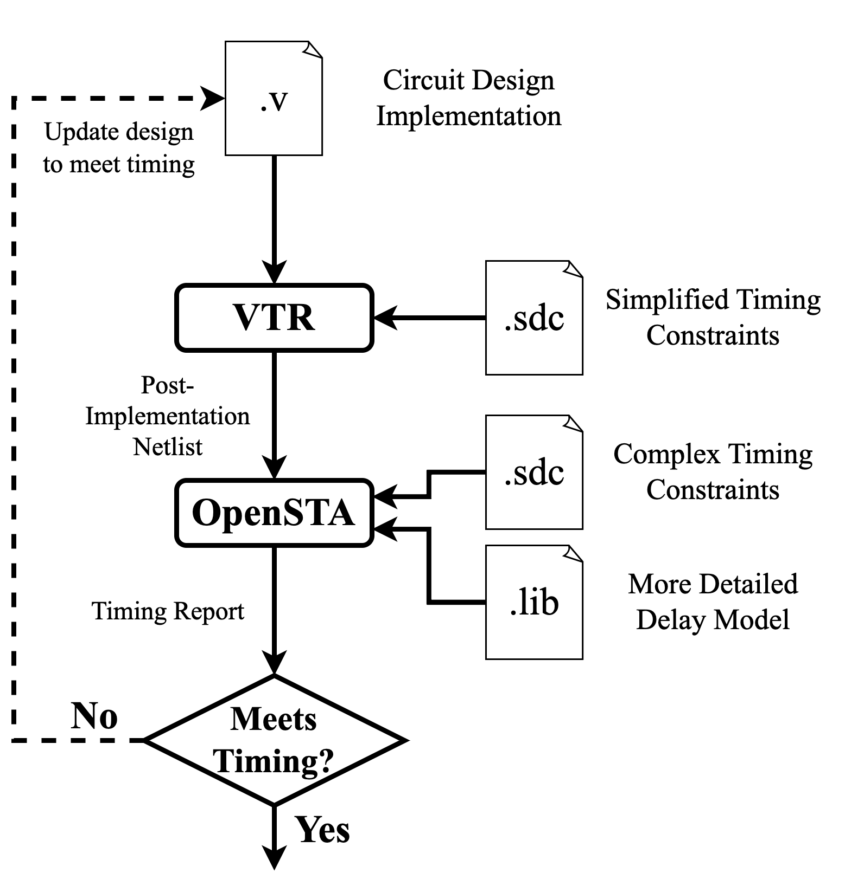

.. _timing_analysis_tutorial:

Post-Implementation Timing Analysis
-----------------------------------

This tutorial describes how to perform static timing analysis (STA) on a circuit which has
been implemented by :ref:`VPR` using OpenSTA, an external timing analysis tool.

A video of this tutorial can be found here: https://youtu.be/yihFJc7WOfE

External timing analysis can be useful since VPR's timing analyzer (Tatum) does
not support all timing constraints and does not provide a TCL interface to allow
you to directly interrogate the timing graph. VPR also has limited support for
timing exceptions such as multi-cycles and false paths, which tools like OpenSTA
have better support for.

Some external tools can also ingest more complex timing models (e.g. four
transition rr, rf, fr, ff delays vs. VTR's modeling of all transitions having
the same min,max range).

.. _fig_timing_analysis_design_cycle:

    Post-implementation timing analysis design cycle.

A user design cycle which would use post-implementation timing analysis could perform the following:
    1. Run VPR with the timing commands it can support (simplified constraints).
    2. Perform timing analysis on the resulting netlist using OpenSTA with
       more complex timing commands.
    3. The user can then modify the design to meet the complex timing constraints based on the timing report produced by OpenSTA.
    4. The design can then be fed back into VPR and the process can repeat until all constraints are met.

Generating the Post-Implementation Netlist for STA
~~~~~~~~~~~~~~~~~~~~~~~~~~~~~~~~~~~~~~~~~~~~~~~~~~

For this tutorial, we will be using the ``clma`` :ref:`benchmark <benchmarks>`
targetting the ``k6_frac_N10_frac_chain_mem32K_40nm.xml`` architecture.

We will first create a working directory to hold all the timing analysis files:

.. code-block:: console

   $ mkdir timing_analysis_tut
   $ cd timing_analysis_tut

Next we will copy over the benchmark and FPGA architecture into the working
directory for convenience:

.. code-block:: console

   $ cp $VTR_ROOT/vtr_flow/benchmarks/blif/clma.blif .
   $ cp $VTR_ROOT/vtr_flow/arch/timing/k6_frac_N10_frac_chain_mem32K_40nm.xml .

.. note:: Replace :term:`$VTR_ROOT` with the root directory of the VTR source tree

To perform timing analysis externally to VTR, we need to provide an SDC file
which will contain the timing constraints on the clocks and I/Os in the circuit.
For this tutorial, we will use the following ``clma.sdc`` file:

.. code-block:: tcl
    :linenos:
    :caption: SDC file ``clma.sdc`` used for timing analysis.

    # Set pclk to be a clock with a 16ns period.
    create_clock -period 16 pclk

    # Set the input delays of all input ports in the clma design to be 0 relative to pclk.
    set_input_delay -clock pclk -max 0 [get_ports {pi*}]

    # Set the output delays of all output ports in the clma design to be 0 relative to pclk.
    set_output_delay -clock pclk -max 0 [get_ports {p__*}]

Next, we can generate the post-implementation netlist and other necessary files
for timing analysis using VPR.

.. code-block:: console

   $ vpr \
   $    k6_frac_N10_frac_chain_mem32K_40nm.xml \
   $    clma.blif \
   $    --route_chan_width 100 \
   $    --sdc_file clma.sdc \
   $    --gen_post_synthesis_netlist on \
   $    --gen_post_implementation_sdc on \
   $    --post_synth_netlist_unconn_inputs gnd \
   $    --post_synth_netlist_module_parameters off

In this command, we provide the architecture, circuit, the channel width, and
the SDC file. The other four commands are what generate the necessary netlist
files for timing analysis:
 * ``--gen_post_synthesis_netlist on``: This will generate the post-implementation netlist as a Verilog file.
 * ``--gen_post_implementation_sdc on``: This will have VPR generate a new SDC file which contains extra timing information (e.g. clock delays) based on how VPR implemented the design.
 * ``--post_synth_netlist_unconn_inputs gnd``: For timing analysis with OpenSTA, we should be explicit about how we handle unconnected signal ports. Here we just ground them for simplicity.
 * ``--post_synth_netlist_module_parameters off``: OpenSTA does not allow parameters to be used in the netlist. This command tells VPR to generate a netlist without using parameters.

Once VPR has completed, we should see the generated Verilog netlist, SDF file, and SDC file:

.. code-block:: console

    $ ls *.v *.sdf *.sdc
    top_post_synthesis.sdc  top_post_synthesis.sdf  top_post_synthesis.v

Performing Timing Analysis using OpenSTA
~~~~~~~~~~~~~~~~~~~~~~~~~~~~~~~~~~~~~~~~

To perform static timing analysis for this tutorial, we will be using OpenSTA (https://github.com/parallaxsw/OpenSTA ).
Other STA tools can be used, however they may use slightly different commands.

First, install OpenSTA onto your system. Building from source is a good option,
which can be done using the following instructions:
https://github.com/parallaxsw/OpenSTA?tab=readme-ov-file#build-from-source

After OpenSTA is installed, we can perfrom static timing analysis on the post-implementation
netlist generated by VPR.

It is easiest to write a ``sdf_delays.tcl`` file to setup and configure the timing analysis:

.. code-block:: tcl
    :linenos:
    :caption: OpenSTA TCL file ``sdf_delays.tcl``. Note that :term:`$VTR_ROOT` should be replaced with the relevant path.

    # Read a skeleton of a liberty file which contains just enough information to
    # allow OpenSTA to perform timing analysis on the post-synthesized netlist using
    # an SDF file. This contains descriptions of the timing arcs of the primitives
    # in the circuit.
    read_liberty $VTR_ROOT/vtr_flow/primitives.lib

    # Read the post-implementation netlist generated by VPR.
    read_verilog top_post_synthesis.v

    # Link the top-level design.
    link_design top

    # Read the post-synthesis SDF file.
    read_sdf top_post_synthesis.sdf

    # Read the SDC commands generated by VPR.
    read_sdc top_post_synthesis.sdc

    # Report the setup and hold timing checks using OpenSTA and write them to files.
    report_checks -group_path_count 100 -digits 3 -path_delay max > open_sta_report_timing.setup.rpt
    report_checks -group_path_count 100 -digits 3 -path_delay min > open_sta_report_timing.hold.rpt

    # Report the minimum period of the clocks and their fmax.
    report_clock_min_period

    # Exit OpenSTA's TCL terminal.
    # This can be removed if you want terminal access to write TCL commands after
    # executing the prior commands.
    exit

Now that we have a ``.tcl`` file, we can launch OpenSTA from the terminal and run it:

.. code-block:: console

   $ sta sdf_delays.tcl

Running this command will open a TCL terminal which will execute all of the commands
in ``sdf_delays.tcl``. The TCL file above will write setup and hold timing reports (similar to
the reports written by VPR), report the minimum period of all clocks, and then exit the OpenSTA TCL terminal.

You can compare the timing reports generated by OpenSTA (``open_sta_report_timing.{setup/hold}.rpt``)
to the timing reports generated by VPR (``report_timing.{setup/hold}.rpt``).
You can also compare the minimum period reported by OpenSTA with the final
period reported by VTR at the bottom of ``vpr_stdout.log``.

The TCL file above is just an example of what OpenSTA can do. For full documentation
of the different commands available in OpenSTA, see:
https://github.com/parallaxsw/OpenSTA/blob/master/doc/OpenSTA.pdf

