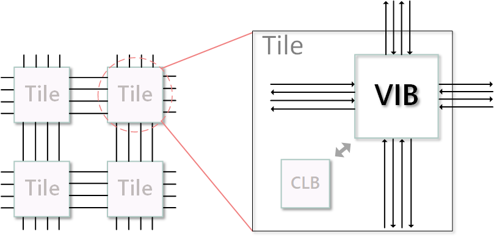
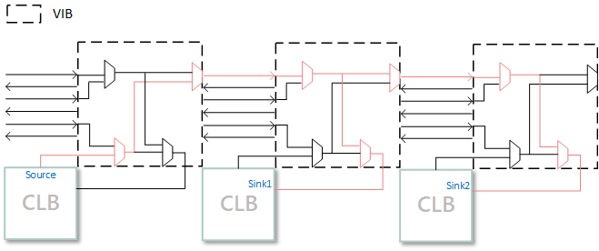

.. _VIB:

VIB Architecture
============
The VIB architecture adds modeling support for double-level MUX topology and bent wires. In past, switch blocks have only one level of routing MUXes, whose inputs are driven by outputs of programmable blocks and routing tracks. Now outputs of programmable blocks can shape the first level of routing MUXes, while the inputs of second level involves the outputs of first level and other routing tracks. This can reduce the number and input sizes of routing MUXes.

Figure 1 shows the proposed VIB architecture which is tile-based. Each tile is composed of a CLB and a VIB. Each CLB can interact with the corresponding VIB which contains all the routing programmable switches in one tile. Figure 2 shows an example of the detailed interconnect architecture in VIB. The CLB input muxes and the driving muxes of wire segments can share the same fanins. A routing path of a net with two sinks is presented red in the Figure.

    
    Figure 1. VIB architecture. The connections between the inputs and outputs of the LB and the routing wires are all implemented within the VIB.

    
    Figure 2. Double-level MUX topology.

Figure 3 shows the modeling for bent wires. A bent L-length wire is modeled as two segments in CHANX and CHANY respectively connected by a delayless switch. The orange and red arrows represent conterclockwise and clockwise bent wires respectively. The bent wires can connect to both bent and straight wire segments.
    
.. figure:: ../Images/bent_wires.png
    :align: center
    
    Figure 3. Presentation for bent wires.

FPGA Architecture File Modification (.xml)
--------------------------
For original tags of FPGA architecture file see :ref:`fpga_architecture_description`.

Modification for ``<segmentlist>`` Tag
~~~~~~~~~~~~~~~~~~~~~~~~~~~~
The content within the ``<segmentlist>`` tag consists of a group of ``<segment>`` tags.
The ``<segment>`` tag and its contents are described below.

.. arch:tag:: <segment axis="{x|y}" name="unique_name" length="int" type="{bidir|unidir}" res_type="{GCLK|GENERAL}" freq="float" Rmetal="float" Cmetal="float">content</segment>

    :req_param content:
        The switch names and the depopulation pattern as described below.

.. arch:tag:: <sb type="pattern">int list</sb>

.. arch:tag:: <cb type="pattern">int list</cb>

.. arch:tag:: <mux name="string"/>

For bent wires, a new content ``<bent>`` is added in the ``<segment>`` tag.

.. arch:tag:: <cb type="pattern">bent pattern list</cb>

    This tag describes the bent pattern for this particular wire segment.
    For example, a length 4 wire has a bent pattern of ``- - U``.
    A ``-`` indicates no bent at this position and a ``U`` indicates a conterclockwise bent at the position. (``D`` indicates a clockwise bent.)
    
    .. note:: A bent wire should remain consistent in both the x and y axes.

New Added Top Level Tag ``<vib_arch>``
~~~~~~~~~~~~~~~~~~~~~~~~~~~~
The content within the ``<vib_arch>`` tag consists of a group of ``<vib>`` tags. Different ``<vib>`` tags describe the paradigms of VIB, which apply to different positions.

.. arch:tag:: <vib name="vib_name" pbtype_name="pbtype_name" vib_seg_group="int" arch_vib_switch="string">content</vib>

    :req_param name:
        A unique alphanumeric name to identify this VIB type.
        
    :req_param pbtype_name:
        The name of the block type (e.g. clb, memory) that this VIB connects to. 

    .. note:: A block (e.g. clb, dsp) is connected to the VIB on its top-right side, so the input and output pins of the block should be on the top or right side.
        
    :req_param vib_seg_group:
        The number of the segment types in this VIB. 
        
    :req_param arch_vib_switch:
        Name of the mux switch type used to drive wires in the VIB by default, and a custom switch can override this switch type for specific connections if desired.
        
    :req_param content:
        The segment groups and the multistage MUX topology as described below.

The ``content`` of ``<vib>`` tag consists of several ``<seg_group>`` tags and a ``<multistage_muxs>`` tag.
For example:

.. code-block:: xml

    <vib_arch>
        <vib name="vib0" pbtype_name="clb" vib_seg_group="4" arch_vib_switch="mux0">
            <seg_group name="L1" track_nums="12"/>
            <seg_group name="L2" track_nums="20"/>
            <seg_group name="L4" track_nums="16"/>
            <seg_group name="L8" track_nums="16"/>
            <multistage_muxs>
                <first_stage switch_name="mux0">
                    ...
                </first_stage>
                <second_stage>
                    ...
                </second_stage>
            </multistage_muxs>
        </vib>
        <vib name="vib1" pbtype_name="dsp" vib_seg_group="4" arch_vib_switch="mux0">
            ...
        </vib>
    </vib_arch>
            
.. arch:tag:: <seg_group name="seg_name" track_nums="int"/>

    :req_param name:
    	The name of the segment in this VIB described in ``<segmentlist>``.
    	
    :req_param track_nums:
    	The track number of the segment in this VIB.
    	
    .. note:: When using unidirectional segments, the track number of the segment represents the number for one direction. For example, the ``track_nums`` is ``10``, which means total ``20`` tracks of the segment in the channel for both (INC & DEC) directions.
    
.. arch:tag:: <multistage_muxs>content</multistage_muxs>

    :req_param content:
    	The detaild information for first and second MUXes.
    	
The ``content`` of ``<multistage_muxs>`` tag consists of a ``<first_stage>`` tag and a ``<secong_stage>`` tag.

.. arch:tag:: <first_stage switch_name="switch_name">content</first_stage>

    :req_param switch_name:
    	Name of the mux switch type used to drive first stage MUXes in the VIB.
    	
    :req_param content:
    	The details of each MUX.

The ``content`` of ``<first_stage>`` tag consists of many ``<mux>`` tags.

.. arch:tag:: <mux name="mux_name">content</mux>

    :req_param name:
    	Name of the MUX.
    	
    :req_param content:
    	A ``<from>`` tag to describe what pins and wires connect to this MUX.
    	
For example:

.. code-block:: xml

    <first_stage switch_name="mux0">
        <mux name="f_mux_0">
            <from>clb.O[0] clb.O[8] clb.O[12:16]</from>
        </mux>
        <mux name="f_mux_1">
            <from>L1.E2 L1.W2 L1.S8 L1.N8</from>
        </mux>
        ...
    </first_stage>
    
The ``<from>`` tag in ``<mux>`` describes nodes that connects to the MUX. ``clb.O[*]`` means output pin(s); ``L1.E2`` means the track ``2`` in the ``East`` direction of ``L1`` segment.

.. arch:tag:: <second_stage>content</second_stage>
 	
    :req_param content:
    	The details of each MUX.

The ``content`` of ``<second_stage>`` tag consists of many ``<mux>`` tags.

.. arch:tag:: <mux name="mux_name">content</mux>

    :req_param name:
    	Name of the MUX.
    	
    :req_param content:
        A ``<to>`` tag to describe where this MUX connect to and a ``<from>`` tag to describe what pins and wires connect to this MUX.
    	
For example:

.. code-block:: xml

    <second_stage switch_name="mux0">
        <mux name="s_mux_0">
            <to>clb.I[0]</to>
            <from>clb.O[0] clb.O[8] f_mux_0</from>
        </mux>
        <mux name="s_mux_1">
            <to>L1.S1</to>
            <from>L1.E1 L1.W1 f_mux_0 f_mux_1</from>
        </mux>
        ...
    </second_stage>
    
The ``<to>`` tag describes the node this MUX connects to. ``clb.I[*]`` means input pin(s); ``L1.S1`` means the track ``1`` in the ``South`` direction of ``L1`` segment. The ``<from>`` tag in ``<mux>`` describes nodes that connects to the MUX. ``clb.O[*]`` means output pin(s); ``L1.E2`` means the track ``2`` in the ``East`` direction of ``L1`` segment. ``f_mux_0`` means the name of the specific first stage MUX.

New Added Top Level Tag ``<vib_layout>``
~~~~~~~~~~~~~~~~~~~~~~~~~~~~
Content inside this tag specifies VIB grid layout to describe different VIBs applied on different locations.

.. arch:tag:: <fixed_layout name="string">content</fixed_layout>

    :req_param name:
        The name identifying this VIB grid layout. It should be the same as the corresponding layout name inside the ``<layout>`` tag.
        
    :req_param content:
        The content should contain a set of grid location tags. For grid location tags of vib_layout see :ref:`fpga_architecture_description`; ref:`grid_expressions`

For example:

.. code-block:: xml

    <vib_layout>
		<fixed_layout name="fixed_layout">
			<perimeter type="vib_IO" priority="101"/>
			<fill type="vib_clb" priority="10"/>
			<col type="vib_memory" startx="5" starty="1" priority="100"/>
			...
        </fixed_layout>
    </vib_layout>

In this VIB grid layout, ``perimeter``, ``fill``, ``col`` and so on are tags in original ``<layout>`` tag to describe positions of each type of VIB block. The attibute ``type`` should correspond to the ``name`` of a ``<vib>`` tag in ``<vib_arch>``.
Besides, the ``pbtype_name`` of corresponding ``<vib>`` must be the same as the physical block type at this position. In this example, IO blocks are located on the perimeter of the layout. Memory blocks are on column 5 and CLBs are on the rest positions. The ``vib_io``, ``vib_clb`` and ``vib_memory`` are different types of vib blocks corresponding to IO, CLB and memory blocks respectively.
