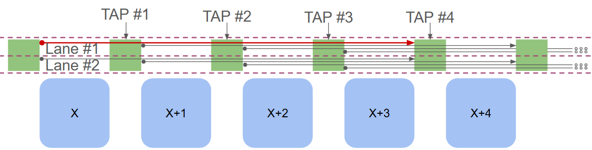

.. _custom_rr_graph:

Custom RR Graph
===============

For users who want more control over how connections are made in the routing resource graph, VPR provides a way to describe them through a Custom RR Graph (CRR) generator.

Currently, the CRR Generator is only based on the tileable RR Graph. Support for the default VPR RR Graph Generator is in progress. To generate a CRR, the following files are required:

* Switch block map file
* Switch block template files

Switch Block Map File
~~~~~~~~~~~~~~~~~~~~~~

This is a YAML file that specifies which switch block template should be used for each tile. The mapping format supports the following patterns:

* ``SB_1__1_: [sb_template.csv]`` - Tile at location (1, 1) uses switch block template ``sb_template.csv``
* ``SB_1__*_: [sb_template.csv]`` - All tiles with x coordinate 1 use switch block template ``sb_template.csv``
* ``SB_[7,20]__[2:32:3]_: [sb_template.csv]`` - Tiles with x equal to 7 or 20, and y coordinates from 2 to 32 (inclusive) with step 3 use switch block template ``sb_template.csv``

**Important:** The order in which patterns are defined matters, as the first matching pattern is used.

Switch Block Template Files
~~~~~~~~~~~~~~~~~~~~~~~~~~~~~~~~~~~~~~

Terminology
-----------

Before describing the template files, let's define some key terminology:

**Lane:** A group of wires with the same length. The starting points of consecutive wires in a lane are one switch block apart.

**Tap:** A switch block location where a wire passes through and can have fan-out connections.

See the figure below for an illustration:

   In the figure above, the taps for the red wire are shown, and the lanes are separated by dotted lines. Note that the figure is simplified for illustration purposes.

In the actual RR Graph, when a wire passes through a switch block, its track number changes. Below is a more realistic example:

.. figure:: lane_and_tap_realistic.png
   :alt: Lane and Tap Realistic
   :width: 50%
   :align: center

   A more realistic example of a lane and a tap. Each box contains a lane.

Template File Format
--------------------

There should be a directory containing the pattern files specified in the switch block maps file. Each template is a CSV file with the following format:

* **Rows** represent source nodes
* **Columns** represent sink nodes
* An **'x' mark** at an intersection indicates that the source and sink nodes are connected
* A **number** at an intersection indicates that the nodes are connected with the switch delay specified by that number

**Note:** The pattern currently only supports uni-directional segments. Therefore, wires can only be driven from their starting point.

Row Headers (Source Nodes)
^^^^^^^^^^^^^^^^^^^^^^^^^^^

Each row has four header columns describing the source node:

1. **Column 1 - Direction:** The side from which the source node is entering the switch block (e.g., 'left', 'right', 'top', 'bottom')
2. **Column 2 - Segment Type:** The segment length to which the source node belongs
3. **Column 3 - Lane Number:** The lane to which the source node belongs (see terminology above)
4. **Column 4 - Tap Number:** Which tap of the source node is at this switch block

Column Headers (Sink Nodes)
^^^^^^^^^^^^^^^^^^^^^^^^^^^^

Each column has header rows describing the sink node:

1. **Row 1 - Direction:** The side from which the sink node is exiting the switch block
2. **Row 2 - Segment Type:** The segment length to which the sink node belongs
3. **Row 3 - Fan-in:** The fan-in of the sink node (optional)
4. **Row 4 - Lane Number:** The lane to which the sink node belongs

Example
^^^^^^^

Consider an architecture with a channel width of ``160`` containing only wire
segments of length ``4`` (L4).

The number of **rows** is computed as:

- ``4`` (number of sides) × ``160/2`` (number of tracks in one direction)
  = ``320`` rows.

On each side, we have:

- ``20`` lanes (``80 / 4``), and
- each lane requires ``4`` rows (since length-4 wires have 4 tap positions).

The number of **columns** is:

- ``4`` (number of sides) × ``160/2`` (number of tracks in one direction) ÷ ``4`` (starting tracks per lane)
  = ``80`` columns.

----

To illustrate how a particular cell in the template file is interpreted, assume
the following row and column specifications:

**Row specification:**

- Direction: ``left``
- Segment type: ``l4``
- Lane number: ``2``
- Tap number: ``3``

**Column specification:**

- Direction: ``right``
- Segment type: ``l4``
- Lane number: ``2``

Assuming ``l4`` is the only segment type, the row specification corresponds to a
source wire entering the switch block from the *left* side. The starting PTC
(track) number for lane 2 is:

.. code-block:: none

   (2 - 1) * 4 * 2 = 8

Thus, the PTC sequence for this L4 wire is (it increases by 2 since the odd PTC numbers are used for wires comming from the other side):

.. code-block:: none

   8, 10, 12, 14

The row refers to the node associated with the **third tap**, meaning the
source node corresponds to the PTC value ``12``. With the starting and ending of the track,
and the PTC values, VPR can determine the source **Node ID**.

For the sink node, the column specification describes a wire exiting the switch
block on the *right* side, using the same PTC sequence:

.. code-block:: none

   8, 10, 12, 14

Using this sequence, VPR determines the sink **Node ID**.

After computing both Node IDs, the tool inserts the switch defined in the
template file, with the associated delay value, into the RR Graph.

----

Each switch block template file must contain the number of rows and columns
calculated in the previous section. After creating a correctly sized template
file, populate it by placing switch delay values in the cells representing valid
connections between source and sink nodes.

Once the switch block map file and template files are created, include the
following arguments in the VPR command line:

- ``--sb_maps <switch_block_map_file>``
- ``--sb_templates <switch_block_template_directory>``
- ``--sb_count_dir <switch_block_count_directory>`` (optional):  
  If provided, VPR generates a CSV file for each switch block template,
  showing how many times each switch specified in the template is used in the
  final routing results.

For additional arguments, refer to the command-line usage section in
:ref:`vpr_command_line_usage`.
