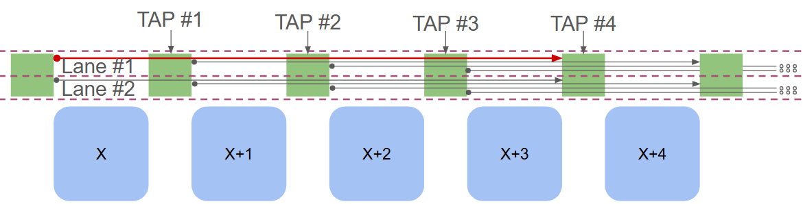
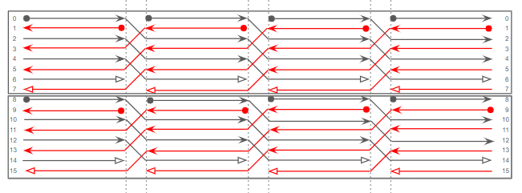

.. _custom_rr_graph_generator:

Custom RR Graph
===============

The Custom RR Graph (CRR) generator lets you specify routing connections using
CSV matrices. It uses the routing wires and block pins created by VPR's tileable
routing resource (RR) graph generator, then connects those resources according to
your templates. A YAML map selects the template to apply at each grid location.
This separates the routing topology from the algorithms that normally generate
switch block and connection block edges.

A CRR description consists of:

* An architecture XML file defining the device layout, physical pins, routing
  segments, and architecture switches.
* A **switch block map** (YAML) assigning grid locations to templates.
* **Switch block templates** (CSV), each describing connections and, optionally,
  switch delays at one location.

CRR currently supports single-layer, two-dimensional architectures with
unidirectional routing and requires ``tileable="true"`` on the architecture's
``<layout>`` element. See :ref:`openfpga_arch_syntax` for the tileable architecture
settings. The CSV channel descriptions below address straight, fixed-length
segments through their length, lane, and tap.

What CRR Controls
-----------------

A generalized switch block (GSB) groups routing connections associated with a
grid location. In CRR, its template describes both wire-to-wire connections and
connections involving physical block pins:

* ``CHANX`` and ``CHANY`` are horizontal and vertical routing wires.
* ``OPIN`` is a physical block output pin that drives routing.
* ``IPIN`` is a physical block input pin driven by routing.

VPR first creates the RR nodes from the architecture and channel width. CRR then
selects a template at each location, resolves its headers to those nodes, and
creates an edge for each populated matrix cell whose endpoints exist. Templates
are parsed and compiled once and reused at every matching location.

.. important::

   CRR templates supply all GSB connections, including output-pin-to-wire and
   wire-to-input-pin connections. The normal GSB edge generation based on
   ``Fc`` and switch block connectivity does not fill gaps in a template.
   Include the required pin connections as well as wire-to-wire connections.

The ordinary ``SOURCE``-to-``OPIN`` and ``IPIN``-to-``SINK`` edges are still
created separately. Architecture-defined direct connections are also handled
separately. A template does not create new wires or pins, or change their physical
locations.

Running VPR with CRR
--------------------

For a complete runnable example, start with `Repository Example and
Troubleshooting`_. To learn the CSV layout, use `Worked CSV Example`_; that small
matrix illustrates the syntax and needs an architecture with matching resources.
When creating a new template, follow `Preparing Your Own Templates`_ to determine
the wire and pin headers before filling in connections.

Supply both the map file and the template directory. Fix the channel width to
match the templates' lane counts; a channel-width search can produce a different
set of wires from the one the templates describe.

For example, with a tileable architecture and templates prepared for channel
width 160:

.. code-block:: console

   vpr architecture.xml circuit.blif \
       --pack --place --route --analysis \
       --route_chan_width 160 \
       --sb_maps crr/sb_maps.yml \
       --sb_templates crr/templates \
       --gsb_version 1 \
       --annotated_rr_graph on

.. list-table:: CRR options
   :header-rows: 1
   :widths: 32 15 53

   * - Option
     - Default
     - Meaning
   * - ``--sb_maps <file>``
     - Empty
     - YAML map selecting one template per location.
   * - ``--sb_templates <directory>``
     - Empty
     - Directory used to resolve template filenames in the map.
   * - ``--gsb_version {1,2}``
     - ``1`` when ``--sb_maps`` is supplied
     - Coordinate convention used to resolve channel descriptions. See
       `Coordinates and GSB Versions`_.
   * - ``--annotated_rr_graph {on,off}``
     - ``off``
     - With ``on``, integer matrix values specify switch delays in picoseconds.
       With ``off``, every populated cell uses an architecture switch.
   * - ``--remove_dangling_nodes {on,off}``
     - ``off``
     - Removes ``CHANX`` and ``CHANY`` nodes with no fan-in after edge creation.
       This does not add missing connections or guarantee routability.

Use ``--route_verbosity 2`` to report generated connections and unresolved channel
descriptions by location. Add ``--write_rr_graph crr.xml`` to inspect the resulting
RR nodes, edges, and switches. General VPR options are documented in
:ref:`vpr_command_line_usage`.

Preparing Your Own Templates
----------------------------

1. Choose the tileable architecture, device layout, and fixed channel width.
   Use GSB version 1 when following this guide's examples. For existing templates,
   retain their intended version; for a design that uses the version 2 coordinate
   convention, use the bounds in `Coordinates and GSB Versions`_.
2. Determine the actual routing resources and physical pins using the reference
   graph procedure below. Record horizontal and vertical allocations separately.
3. Write the complete channel headers in track-allocation order, then add the
   pins present at the locations where each template will be used. Work through
   `Sizing a Template`_ for both single-length and mixed-length examples.
4. Fill connection cells, including output-pin-to-wire and wire-to-input-pin
   connections. Assign templates to locations in the YAML map, with exceptions
   before the catch-all rule.
5. Generate the CRR graph with the matching width and GSB version. Inspect the
   resulting edges and unresolved-node messages before relying on routing results.

Finding Wire and Pin Assignments
~~~~~~~~~~~~~~~~~~~~~~~~~~~~~~~~

With an existing VPR executable, add ``--write_rr_graph reference.xml`` to a run
using your chosen architecture, ``--device``, and ``--route_chan_width``. Leave
``--sb_maps`` and ``--sb_templates`` unset for this reference run, and keep
``--remove_dangling_nodes off``. This lets you inspect the tileable generator's
node inventory before authoring CRR connections. See
:ref:`vpr_route_resource_file` for the XML structure.

Use these fields to prepare the template headers:

* **Channel allocation:** choose an interior horizontal channel location and
  inspect the ``CHANX`` nodes whose ``<loc>`` bounds include it. Each node's
  ``<segment segment_id="...">`` identifies its entry in ``<segments>``; match
  that entry's name to the segment length in the architecture XML. The node's
  ``direction`` and its PTC at the selected location identify the track. Sort
  by that local PTC to find the order and size of each segment allocation.
  Repeat with ``CHANY`` at an interior vertical channel location. Count tracks
  crossing one location, rather than all wire nodes in the device.
* **Track rotation:** a tileable channel node can have a comma-separated
  ``<loc ptc="8,10,12,14" ...>`` sequence. Its entries correspond to successive
  locations from ``xlow`` to ``xhigh`` for ``CHANX``, or ``ylow`` to ``yhigh``
  for ``CHANY``. Select the entry for the location being inspected. For a
  complete length-``L`` allocation, divide its total track count by ``2 * L``
  to obtain its lane count.
* **Physical pin names and indices:** find the tile's ``<block_type>`` under
  ``<block_types>``. Its ``<pin_class>`` entries contain records such as
  ``<pin ptc="41">clb.O[0]</pin>``. Copy the full name into the CSV pin-name
  field and the numeric PTC into its fallback-index field. Use an output pin
  for an ``OPIN`` row and an input pin for an ``IPIN`` column or row.
* **Pin locations:** ``<grid_loc>`` identifies the block type and width/height
  offsets at each ``(x, y)``. Confirm that an ``IPIN`` or ``OPIN`` node with the
  chosen PTC has its ``<loc>`` at the intended map location. A pin belonging to
  a multi-height tile is not necessarily present at every offset of that tile.

A correct pin name takes precedence over the fallback index. Recording both from
the reference graph avoids guessing the index and makes the template easier to
audit. The reference graph's edges come from normal edge generation; the CSV
determines the connections when CRR is enabled.

Switch Block Map File
---------------------

The YAML file must contain an ``SB_MAPS`` mapping. Each entry associates a
coordinate pattern with **one filename**, or with ``null`` to request no CRR
connections at matching locations:

.. code-block:: yaml

   SB_MAPS:
     "SB_1__1_": sb_corner.csv
     "SB_[7,20]__[2:32:3]_": sb_special.csv
     "SB_*__*_": sb_main.csv

Use a scalar filename such as ``sb_main.csv``, not a YAML list such as
``[sb_main.csv]``. Relative filenames are resolved against ``--sb_templates``,
not against the directory containing the YAML file.

Patterns have the form ``SB_<x>__<y>_``: one underscore after ``SB``, two between
the coordinates, and one at the end. Each coordinate specification can be:

.. list-table:: Coordinate patterns
   :header-rows: 1
   :widths: 25 75

   * - Form
     - Meaning
   * - ``7``
     - Exactly coordinate 7.
   * - ``*``
     - Any coordinate.
   * - ``[7,20]``
     - Either coordinate 7 or coordinate 20.
   * - ``[2:32:3]``
     - Coordinates 2, 5, 8, ..., 32. The upper bound is inclusive when reached
       by the step.

Use non-negative coordinates, a positive range step, and no spaces inside a
coordinate specification. Spell ranges with all three fields
``[start:end:step]``; ``[start:end]`` does not match locations. Avoid leading
zeros on literal coordinates. These are coordinate patterns, not general
regular expressions.

**The first matching entry wins.** Later entries neither add connections nor
override an earlier match. Put exceptions before general rules and finish with a
catch-all entry. Every grid location must match a pattern; an unmatched location
is a fatal error. An explicit ``null`` match is valid and contributes no CRR
edges there, while retaining nodes and edges created by other parts of VPR.

For example, this map assumes a 22-by-22 grid whose outer border is empty and
whose inner border contains I/O tiles:

.. code-block:: yaml

   SB_MAPS:
     "SB_0__*_": null
     "SB_*__0_": null
     "SB_21__*_": null
     "SB_*__21_": null
     "SB_1__*_": sb_io_left.csv
     "SB_20__*_": sb_io_right.csv
     "SB_*__1_": sb_io_bottom.csv
     "SB_*__20_": sb_io_top.csv
     "SB_[6,14]__[2:19:1]_": sb_dsp.csv
     "SB_*__*_": sb_main.csv

Here the left and right I/O rules also select the inner corner locations because
they precede the bottom and top rules. Add corner-specific rules earlier if
needed. The DSP rule is appropriate only if those locations share a compatible
pin layout. Multi-height blocks may need a different template for each vertical
offset, as in the repository example described below.

Lanes, Taps, and Tracks
-----------------------

A **track** is a wire position in a routing channel. Its PTC (pin, track, or class)
number is the numeric track identifier used in the RR graph. In a tileable graph,
a wire can have a different PTC at each grid location along its length.

A **lane** groups the track positions within which wires rotate as they extend
across tiles. For length-``L`` segments, a complete lane contains ``L`` tracks in
each direction, or ``2 * L`` physical track positions. Lane numbers in the CSV
start at **1** for each segment group on each side.

A **tap** identifies the position of an incoming wire relative to the switch
block. In the GSB version 1 convention used in the examples, source taps run from
**1** to **L** along the wire's direction of travel. For a particular lane, the
``L`` tap rows select ``L`` different incoming wires at a given switch block.
They also let a wire drive connections at successive switch blocks along its
length.

   A conceptual view of lanes and taps. Track rotation is omitted.
   Green rectangles are switch blocks, blue blocks are logic tiles, and dashed
   horizontal lines separate lanes. The red wire illustrates four taps.

   Track positions rotate within each lane. Even PTCs carry increasing-direction
   wires (gray arrows), and odd PTCs carry decreasing-direction wires (red arrows).
   Dots mark wire starts, the outlined horizontal groups are lanes, and dashed
   vertical lines separate tile positions. The numbers identify PTCs.

A source wire may drive connections at its taps, but a destination wire is driven
at its starting point. A channel column therefore normally uses tap 1, which is
also the default when its tap field is empty.

CSV Template Structure
----------------------

A template is a matrix with **five header rows** and **four header columns**.
The connection matrix starts at **row 6, column 5** (spreadsheet cell **E6**).
All row and column positions in this section are one-based.

.. list-table:: Physical layout of a CSV file
   :header-rows: 1
   :widths: 15 35 50

   * - CSV row
     - Columns A--D (1--4)
     - Columns E onward (5 onward)
   * - 1
     - Empty
     - Destination side or pin kind
   * - 2
     - Empty
     - Destination segment length label
   * - 3
     - Empty
     - Optional fan-in information (ignored by the generator)
   * - 4
     - Empty
     - Destination lane number or fallback pin PTC
   * - 5
     - Empty
     - Destination tap or pin name
   * - 6 onward
     - Source side/kind, segment label, lane/index, tap/name
     - Connection cells

Keep the upper-left five-by-four rectangle empty. Even when a header row contains
no values, retain its CSV line with the appropriate commas. A completely empty
line is discarded by the reader and cannot stand in for a header row.

Source Row Headers
~~~~~~~~~~~~~~~~~~

Each source row uses the following four fields:

.. list-table:: Source fields in columns A--D
   :header-rows: 1
   :widths: 12 44 44

   * - Column
     - Channel row
     - Pin row
   * - A
     - Side the wire enters from: ``LEFT``, ``RIGHT``, ``TOP``, or ``BOTTOM``.
     - ``OPIN``, or ``IPIN`` with the direction reversal explained below.
   * - B
     - ``L`` followed by segment length, for example ``L4``.
     - Unused; leave empty.
   * - C
     - One-based lane number within this segment group and side.
     - Zero-based physical pin PTC used if name lookup fails.
   * - D
     - Source tap number; supply it explicitly.
     - Full physical pin name, for example ``clb.O[0]``.

Destination Column Headers
~~~~~~~~~~~~~~~~~~~~~~~~~~

Each destination column uses five header fields:

.. list-table:: Destination fields in rows 1--5
   :header-rows: 1
   :widths: 12 44 44

   * - Row
     - Channel column
     - Pin column
   * - 1
     - Side the wire exits toward: ``LEFT``, ``RIGHT``, ``TOP``, or ``BOTTOM``.
     - ``IPIN``. An ``OPIN`` column is unsupported and its cells are ignored.
   * - 2
     - Segment length label, for example ``L4``.
     - Unused; leave empty.
   * - 3
     - Optional descriptive fan-in count.
     - Optional descriptive fan-in count.
   * - 4
     - One-based lane number within this segment group and side.
     - Zero-based fallback physical pin PTC.
   * - 5
     - Destination tap; empty means 1. Use empty or 1 for a wire starting here.
     - Full physical pin name, for example ``clb.I[0]``; required.

The fan-in row is informational: VPR neither checks it against the matrix nor
uses it to create connections or select a switch. Keep the row even if all its
cells are empty.

Header Spelling, Ordering, and Empty Fields
~~~~~~~~~~~~~~~~~~~~~~~~~~~~~~~~~~~~~~~~~~~

Side and pin-kind keywords are case-insensitive. Use consistent segment labels,
preferably ``L4``, ``L8``, and so on. A channel's label encodes its length; it is
not looked up by name in the architecture's ``<segmentlist>``.

Here, a **segment group** is a consecutive run of the same channel-length label
on one side of a CSV axis. A change of label starts a new group and advances the
PTC offset. An XML segment declaration alone does not start a new CSV group.
For adjacent architecture segment types of the same length, each occupying
complete lanes, continue lane numbering across their allocations under the same
label. Restarting at lane 1 with an unchanged label would select the earlier
lanes again.

**Header order affects PTC assignment.** On each axis, keep each channel side in
one contiguous group. Within a side, list segment groups in the order in which
the architecture allocates their tracks, and list lanes in increasing order.
Keep source taps for each lane together. Restart lane numbering at 1 for each
segment group and each side. Put pin rows and columns after the channel groups.
The source and destination headers for a side must describe the same track
allocation, even though source rows enumerate taps and destination columns
enumerate starting wires.

The parser calculates offsets from preceding groups; it does not independently
look up every header by segment name. Consequently, reordering groups, changing
label spelling midway through a group, or removing preceding groups can change
which wires later headers select. Preserve headers and leave connection cells
empty when a wire should have no connections.

The reader supports limited inheritance of empty header fields:

* Destination side and segment label (rows 1 and 2) are filled to the right from
  the most recent non-empty value.
* Source lane/index (column C) is filled downward from the most recent non-empty
  value.
* Other fields are not filled this way. In particular, repeat the source side
  and segment label on every channel row, and supply each source tap.

Explicitly repeating header values makes a template easier to inspect. Use the
same number of comma-separated fields on every line. The first line determines
the file width; shorter lines are padded with empty cells, but later lines cannot
add columns. Surrounding whitespace is trimmed, and quoted fields are supported.
There is no CSV comment syntax: keep explanatory notes outside the matrix.

Connection Cells and Delays
~~~~~~~~~~~~~~~~~~~~~~~~~~~

Normally, a populated cell creates a directed edge **from its row node to its
column node**. It does not create the reverse edge.

.. list-table:: Meaning of a matrix cell
   :header-rows: 1
   :widths: 20 40 40

   * - Cell
     - ``--annotated_rr_graph off``
     - ``--annotated_rr_graph on``
   * - Empty
     - No edge.
     - No edge.
   * - ``x``
     - Edge using the destination's architecture-defined driver switch.
     - Edge using the destination's architecture-defined driver switch.
   * - ``120``
     - Edge using the destination's architecture-defined driver switch.
     - Edge using a generated switch with ``Tdel = 120 ps``.
   * - ``0``
     - Edge using the destination's architecture-defined driver switch.
     - Edge using a generated switch with ``Tdel = 0 ps``.

Use non-negative whole-number delays written as plain integers in picoseconds.
Decimal or scientific notation such as ``120.0`` or ``1.2e2`` is not interpreted
as an annotated delay. Non-integer text is treated as a connection marker with
an architecture switch, so a typo in a delay may still create an edge. Use
``x`` consistently for unannotated connections. **Only an empty cell means no
connection; zero is a connection.**

For architecture-switch connections, the driver switch is selected from the
actual destination node. A channel destination uses its segment's output-pin
switch (including its decreasing-direction variant when configured); an
``IPIN`` destination uses the architecture's wire-to-input-pin switch.

An annotated connection uses a generated multiplexer switch with the specified
intrinsic delay and zero switch resistance and input/output capacitance. The
wire nodes retain their architecture-defined resistance and capacitance. A CSV
value therefore specifies **switch delay**, not the complete routed connection
delay.

Pin Connections
~~~~~~~~~~~~~~~

An ``OPIN`` row connects an output pin to channel columns. An ``IPIN`` column
receives connections from channel rows. The format also supports an ``IPIN``
**row**: in that case, VPR reverses the edge so the column node drives the row's
input pin. For example, an ``x`` at an ``IPIN`` row and a ``RIGHT`` channel column
means ``RIGHT channel -> IPIN``, not ``IPIN -> RIGHT channel``.
The channel column still identifies the same outgoing wire; for this cell,
that wire is the source of the connection to the input pin.

Pin names are matched against the physical tile type at the map location
``(x, y)``. Examples include ``clb.O[0]``, ``clb.I[0]``, and
``io[0].inpad[0]``. Copy the exact exported physical pin name, including its port
name, bit index, and any capacity-instance index. The instance index is included
when the corresponding sub-tile has capacity greater than one. Pin-name matching
is case-sensitive; `Finding Wire and Pin Assignments`_ explains where to find
these names and their PTCs.

A pin name is required even when a numeric fallback PTC is supplied. If the name
is not found, the generator tries the fallback index. If the requested pin node
cannot be found at that exact location, generation fails. This applies even if
the pin's row or column contains no connections. Choose templates appropriate to
the tile type and to the pin locations within multi-width or multi-height tiles.
A misspelled name can still resolve through a valid fallback PTC, potentially
connecting the wrong pin without stopping generation. Check fallback messages
and record the matching name and index together.

Worked CSV Example
------------------

This small example describes one lane of ``L2`` wires on each side, one block
output, and one block input. It assumes a channel width of 4 (two tracks per
direction), GSB version 1, and a tile with ``clb.O[0]`` and ``clb.I[0]`` pins.
The fallback pin PTCs shown are 41 and 0; these indices must be checked against
your architecture. The selected connections illustrate the file format rather
than a complete routable fabric.

.. code-block:: text

   ,,,,LEFT,RIGHT,TOP,BOTTOM,IPIN
   ,,,,L2,L2,L2,L2,
   ,,,,,,,,
   ,,,,1,1,1,1,0
   ,,,,1,1,1,1,clb.I[0]
   LEFT,L2,1,1,,120,,,x
   LEFT,L2,1,2,,,x,,
   RIGHT,L2,1,1,x,,,,
   RIGHT,L2,1,2,,,,x,
   TOP,L2,1,1,,x,,,
   TOP,L2,1,2,x,,,,
   BOTTOM,L2,1,1,,,x,,
   BOTTOM,L2,1,2,,x,,,
   OPIN,,41,clb.O[0],x,0,,,

The file has 14 rows and 9 columns: five header rows plus nine source rows, and
four header columns plus five destination columns. The third line is an empty
fan-in header row represented by eight commas.

With ``--annotated_rr_graph on``:

* Cell **F6** (``120``) connects the ``LEFT`` incoming wire in lane 1 at tap 1
  to the ``RIGHT`` outgoing wire in lane 1, using a 120 ps switch.
* Cell **I6** (``x``) connects that same incoming wire to ``clb.I[0]`` using the
  architecture's wire-to-input-pin switch.
* Cell **E14** (``x``) connects ``clb.O[0]`` to the ``LEFT`` outgoing wire using
  that wire's architecture-defined driver switch.
* Cell **F14** (``0``) connects ``clb.O[0]`` to the ``RIGHT`` outgoing wire using
  a zero-delay switch. It does not disable that connection.

With annotation disabled, the same edges are requested, but the ``120`` and
``0`` cells use architecture switches too.

Sizing a Template
-----------------

For an interior switch block with channel width ``W``, only one segment length
``L``, and complete lanes, there are ``W / 2`` tracks in each direction and
``W / (2 * L)`` lanes per side. A channel-only template representing every
incoming tap and every outgoing starting wire has:

.. code-block:: text

   channel source rows         = 4 * (W / 2)
   channel destination columns = 4 * W / (2 * L)

For ``W = 160`` and ``L = 4``, this gives 20 lanes per side, 320 channel source
rows, and 80 channel destination columns. Including the headers, the channel-only
CSV is **325 rows by 84 columns**. Add rows for output pins and columns for input
pins, or account separately for input pins represented as rows.

These counts describe a full matrix under the stated assumptions, not a universal
file-size requirement enforced by the parser. Mixed segment lengths, different
horizontal and vertical track allocations, and location-specific pins change the
counts. Use the actual track allocation produced by the tileable generator;
segment frequencies and rounding can affect it.

Mixed Segment Lengths
~~~~~~~~~~~~~~~~~~~~~

Suppose the actual allocation on each channel is two complete ``L2`` lanes
followed by one complete ``L4`` lane. There is one architecture segment type per
length in this example. The channel width is ``2 * 2 * 2 + 1 * 4 * 2 = 16``.

.. list-table:: Track allocation on each side
   :header-rows: 1
   :widths: 18 14 22 23 23

   * - CSV label
     - Lane
     - Physical PTC range
     - Source taps
     - Destination columns
   * - ``L2``
     - 1
     - 0--3
     - 1, 2
     - One, at tap 1
   * - ``L2``
     - 2
     - 4--7
     - 1, 2
     - One, at tap 1
   * - ``L4``
     - 1
     - 8--15
     - 1, 2, 3, 4
     - One, at tap 1

For GSB version 1, the source header fields on the LEFT side are:

.. code-block:: text

   LEFT,L2,1,1
   LEFT,L2,1,2
   LEFT,L2,2,1
   LEFT,L2,2,2
   LEFT,L4,1,1
   LEFT,L4,1,2
   LEFT,L4,1,3
   LEFT,L4,1,4

These lines show only columns A--D; append the connection cells to form CSV rows.
The corresponding three destination columns, in order, describe
``LEFT / L2 / lane 1``, ``LEFT / L2 / lane 2``, and ``LEFT / L4 / lane 1``, each
with tap 1 or an empty tap field. Repeat the allocation for the other sides,
changing the side keyword and restarting the lane numbers within each group.

The two ``L2`` lanes occupy eight PTC positions, so the ``L4`` group starts at
offset 8 on both axes. Its lane number restarts at 1 because its label changes
from ``L2`` to ``L4``. Omitting the ``L2`` headers would incorrectly move this
``L4`` lane to offset 0; leave their connection cells empty when they are unused.

Each side contributes eight source rows and three destination columns. With
four sides and no pins, the matrix has 32 source rows and 12 destination columns,
or **37 rows by 16 columns including headers**. These counts assume the stated
allocation has been confirmed in the reference graph.

Coordinates and GSB Versions
----------------------------

Map coordinates are zero-based device-grid coordinates. For a grid of width
``W`` and height ``H``, the generator visits ``x = 0 .. W-1`` and
``y = 0 .. H-1``, including the perimeter. The map patterns do not change meaning
between GSB versions; the channel coordinates derived from their templates do.
Increasing x points right and increasing y points up. The examples in this guide
use version 1. Use version 2 when defining or consuming templates whose intended
wire positions follow its convention; it is not an automatic conversion of a
version 1 template. Lane numbers remain one-based in both versions.

For channel columns with the default tap of 1, the starting coordinates are:

.. list-table:: Outgoing wire starts relative to ``SB_x__y_``
   :header-rows: 1
   :widths: 20 25 27 28

   * - Column side
     - Travel direction
     - GSB version 1
     - GSB version 2
   * - ``LEFT``
     - Decreasing x
     - ``(x, y)``
     - ``(x, y)``
   * - ``RIGHT``
     - Increasing x
     - ``(x+1, y)``
     - ``(x, y)``
   * - ``TOP``
     - Increasing y
     - ``(x, y+1)``
     - ``(x, y)``
   * - ``BOTTOM``
     - Decreasing y
     - ``(x, y)``
     - ``(x, y)``

For source rows, the tap ``t`` and segment length ``L`` determine the following
inclusive bounds. Horizontal wires remain at y and vertical wires remain at x.
All bounds in these tables are before boundary clipping.

.. list-table:: Incoming wire bounds relative to ``SB_x__y_``
   :header-rows: 1
   :widths: 18 14 34 34

   * - Row side
     - Axis
     - GSB version 1
     - GSB version 2
   * - ``LEFT``
     - x
     - ``[x-t+1, x+L-t]``
     - ``[x-t, x+L-t-1]``
   * - ``RIGHT``
     - x
     - ``[x+t+1-L, x+t]``
     - ``[x+t+1-L, x+t]``
   * - ``TOP``
     - y
     - ``[y+t+1-L, y+t]``
     - ``[y+t+1-L, y+t]``
   * - ``BOTTOM``
     - y
     - ``[y-t+1, y+L-t]``
     - ``[y-t, y+L-t-1]``

Thus, for the same tap, version 2 shifts LEFT/BOTTOM source bounds one location
toward decreasing x/y, while RIGHT/TOP source bounds are unchanged. At tap 1, a
LEFT source starts at x in version 1 and at x-1 in version 2; a BOTTOM source
starts at y or y-1, respectively. RIGHT/TOP sources at tap 1 start at x+1/y+1
in both versions and travel toward decreasing coordinates.

The parser uses the supplied source tap in these calculations without checking
a version-specific range. The ``1 .. L`` source rows shown earlier enumerate
the version 1 convention. When authoring version 2 headers, use the bounds above
to select the intended wires and verify them against the reference graph;
do not assume that changing versions means renumbering every tap from zero.
Changing a tap changes wire selection, not just its label. Pins are resolved
at ``(x, y)`` in both versions.

The generator clips channel bounds to the device's routing region and adjusts
the PTC sequence for boundary truncation. A channel description must then match
an existing node's bounds and full PTC sequence. If it does not match, connections
using that channel are skipped. Missing pin nodes instead cause an error. An
interior wire template can therefore lose connections near the perimeter, and
pin-bearing templates must still match the pins available at each location.

Tracing an L4 Connection to RR Nodes
~~~~~~~~~~~~~~~~~~~~~~~~~~~~~~~~~~~~

Consider GSB version 1 at an interior location ``(10, 10)`` with only ``L4``
segments. A source row ``LEFT,L4,2,3`` identifies lane 2 at tap 3. The even PTC
base for this lane is:

.. code-block:: text

   (lane - 1) * length * 2 = (2 - 1) * 4 * 2 = 8

The wire travels in the increasing-x direction. Its bounds are ``x = 8 .. 11``
at ``y = 10``, with PTCs ``8, 10, 12, 14`` at those successive coordinates.
At the switch block's x coordinate, 10, its PTC is 12.

A destination column ``RIGHT / L4 / lane 2 / tap 1`` selects another wire,
starting at ``(11, 10)`` and extending through ``(14, 10)``. It has the same PTC
sequence, ``8, 10, 12, 14``, at its own successive coordinates. These are distinct
RR nodes: a PTC alone does not identify a wire without its location and extent.
A populated cell connects the first node to the second.

With the same headers and map coordinate under **GSB version 2**, the LEFT source
instead spans ``x = 7 .. 10`` and the RIGHT destination spans ``x = 10 .. 13``,
both at ``y = 10``. Each still has PTC sequence ``8, 10, 12, 14`` along its own
extent. At ``(10, 10)``, the source has PTC 14 and the destination has PTC 8.
The populated cell therefore selects a different pair of nodes than in version 1.

For decreasing-direction wires, odd PTCs are used and the sequence decreases by
2 as the spatial coordinate increases. When several segment groups share a
channel side, the preceding groups contribute an additional offset to the lane
base. This is why template header order must agree with track allocation.

Repository Example and Troubleshooting
--------------------------------------

The ``strong_crr`` regression task provides a complete architecture-specific
example. Its files are under:

.. code-block:: text

   vtr_flow/tasks/regression_tests/vtr_reg_strong/strong_crr/config/
       CSV_SB_MAPS.yml
       csv_annotated_sw/
           sb_main.csv
           sb_io_left.csv
           sb_io_right.csv
           sb_io_top.csv
           sb_io_bottom.csv
           sb_mult_0.csv ... sb_mult_3.csv
           sb_memory_0.csv ... sb_memory_5.csv

Those templates use channel width **200** and the ``vtr_extra_small`` layout in
``vtr_flow/arch/timing/k6_frac_N10_frac_chain_mem32K_40nm_tileable_crr.xml``.
The map includes separate templates for offsets within multi-height multiplier
and memory tiles. It is not a general map for other device sizes or layouts.

To use this example from the repository root with an existing VPR executable:

.. code-block:: bash

   crr_config=vtr_flow/tasks/regression_tests/vtr_reg_strong/strong_crr/config
   vpr/vpr \
       vtr_flow/arch/timing/k6_frac_N10_frac_chain_mem32K_40nm_tileable_crr.xml \
       vtr_flow/benchmarks/blif/4/ex5p.blif \
       --pack --place --route --analysis \
       --device vtr_extra_small --route_chan_width 200 \
       --sb_maps "$crr_config/CSV_SB_MAPS.yml" \
       --sb_templates "$crr_config/csv_annotated_sw" \
       --gsb_version 1 --annotated_rr_graph on

When preparing your own files, use these checks to diagnose common problems:

.. list-table:: Common symptoms
   :header-rows: 1
   :widths: 30 70

   * - Symptom
     - What to check
   * - ``No pattern found for switch block``
     - Cover all grid locations, including borders, and put a catch-all pattern
       last. Check range syntax and the chosen device size.
   * - A template file cannot be loaded
     - Use a scalar filename in YAML, verify ``--sb_templates``, and use a
       ``.csv`` extension. All referenced templates are loaded up front, even
       if their patterns do not match the selected device.
   * - Missing or incorrect pin connections
     - Check the physical pin name and fallback PTC, the tile type selected by
       the map, and the pin's position within a multi-height or multi-width
       tile. Inspect name-lookup fallback messages at ``--route_verbosity 2``.
   * - Fewer channel connections than expected
     - Check channel width, segment-group order, lane and tap numbers, GSB
       version, and boundary clipping. Inspect ``Node not found`` messages at
       ``--route_verbosity 2``.
   * - Numeric cells do not change switch delays
     - Enable ``--annotated_rr_graph on`` and use plain integer values in ps.
   * - Routing is disconnected despite wire-to-wire edges
     - Include ``OPIN`` and ``IPIN`` connections. Check that zeros were not
       used to mean empty cells and that ``null`` map entries are intentional.

Implementation Reference
~~~~~~~~~~~~~~~~~~~~~~~~

The implementation is in
``vpr/src/route/rr_graph_generation/tileable_rr_graph/``. The main components are:

.. list-table:: Code responsibilities
   :header-rows: 1
   :widths: 47 53

   * - File within that directory
     - Responsibility
   * - ``crr_generator/crr_switch_block_manager.cpp``
     - Loads YAML and unique CSV files, preserving pattern priority.
   * - ``crr_generator/crr_pattern_matcher.h``
     - Parses and matches coordinate patterns.
   * - ``crr_generator/data_frame_processor.cpp``
     - Reads CSV cells and fills inherited header values.
   * - ``crr_generator/crr_compiled_template.cpp``
     - Compiles headers, assigns lane PTC bases, and interprets connection cells.
   * - ``crr_generator/crr_connection_builder.cpp``
     - Resolves coordinates and pins, handles input-pin row reversal, and removes
       duplicate connections at a location.
   * - ``crr_generator/crr_edge_builder.cpp``
     - Creates delay-annotated switches and inserts the selected edges.
   * - ``tileable_rr_graph_edge_builder.cpp``
     - Invokes CRR in place of ordinary GSB edge construction.
