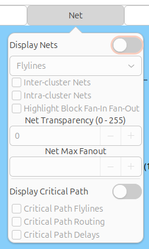

.. _vpr_graphics:

Graphics
========
VPR includes easy-to-use graphics for visualizing both the targeted FPGA architecture, and the circuit VPR has implemented on the architecture.

.. image:: https://www.verilogtorouting.org/img/des90_routing_util.gif
    :align: center

Enabling Graphics
-----------------

Compiling with Graphics Support
~~~~~~~~~~~~~~~~~~~~~~~~~~~~~~~
The build system will attempt to build VPR with graphics support by default.

If all the required libraries are found the build system will report::

    -- EZGL: graphics enabled

If the required libraries are not found cmake will report::

    -- EZGL: graphics disabled

and list the missing libraries::

    -- EZGL: Failed to find required X11 library (on debian/ubuntu try 'sudo apt-get install libx11-dev' to install)
    -- EZGL: Failed to find required Xft library (on debian/ubuntu try 'sudo apt-get install libxft-dev' to install)
    -- EZGL: Failed to find required fontconfig library (on debian/ubuntu try 'sudo apt-get install fontconfig' to install)
    -- EZGL: Failed to find required cairo library (on debian/ubuntu try 'sudo apt-get install libcairo2-dev' to install)

Enabling Graphics at Run-time
~~~~~~~~~~~~~~~~~~~~~~~~~~~~~
When running VPR provide :option:`vpr --disp` ``on`` to enable graphics.

Saving Graphics at Run-time
~~~~~~~~~~~~~~~~~~~~~~~~~~~~~
When running VPR provide :option:`vpr --save_graphics` ``on`` to save an image of the final placement and the final routing created by vpr to pdf files on disk. The files are named vpr_placement.pdf and vpr_routing.pdf.

A graphical window will now pop up when you run VPR.

Navigation
----------
* Click on the **Zoom Fit** button to get an over-encompassing view of the FPGA architecture.
* Click and drag with the left mouse button to pan the view, or scroll the mouse wheel to zoom in and out.
* Click on the **Zoom Select** button, then on the diagonally opposite corners of a box, to zoom in on a particular area.
* Click on **Save** under the **Misc.** tab to save the image on screen to PDF, PNG, or SVG file.
* **Next Step** tells VPR to continue with the next step in placing and routing the circuit.

.. note:: Menu buttons will be greyed out when they are not selectable (e.g. VPR is working).

Placement
--------------------------------
By default VPR's graphics displays the FPGA floorplan (block grid) and current placement.

.. figure:: ../Images/Overall_view.png
    :align: center 
    :width: 50%

    FPGA floorplan (block grid)    

If the **Placement Macros** drop down is set, any placement macros (e.g. carry chains, which require specific relative placements between some blocks) will be highlighted.

.. figure:: https://www.verilogtorouting.org/img/neuron_placement_macros.gif
    :align: center
    :width: 50%

    Placement with macros (carry chains) highlighted

Nets
----------------
To visualize nets, first enable the **Display Nets** switch under the **Net** Tab.

The user can choose between drawing nets as **Flylines** (direct connections between sources and sinks) or as **Routing** (the actual routed path of the net).
Only the **Flylines** option is available during placement, as routing has not yet been performed.

The Inter-Cluster Nets and Intra-Cluster Nets options allow the user to choose whether to visualize nets between clbs or within a clb, respectively. The Intra-Cluster Routed Nets option is currently only available when **flat routing is enabled**.

    Net Tab

If routing is shown, clicking on a pin or channel wire will highlight the whole net in magenta.
Multiple nets can be highlighted by pressing ctrl + mouse click.

    Visualizing Nets

When the **Highlight Block Fan-in and Fan-out** option is enabled, clicking on an internal block will draw its fan-in, fan-out, and internal flylines in blue, red, and yellow, respectively. 

    Highlight Block Fan-in and Fan-out Flylines

Clicking on a clb (not the internal physical blocks) will also highlight all the fan-in and fan-out routed nets in blue and red, respectively.

Critical Path
-----------------------------
During placement and routing you can click on the **Display Critical Path** switch under the **Net** tab to visualize the critical path.
Each stage between primitive pins is shown in a different colour.

    Critical Path with all options enabled.

* During placement the critical path is shown only as flylines.
* During routing the critical path can be shown as both flylines and routed net connections.

.. figure:: https://www.verilogtorouting.org/img/des90_cpd.gif
    :align: center
    :width: 50%

    Critical Path flylines during placement and routing

Routing Architecture
--------------------------------

During the route stage, the **Route** tab provides various options to visualize router resources and statistics.

.. figure:: ../Images/Routing_Options.png
    :align: center 
    :width: 25%

    Routing Options

To visualize routing architecture, first enable the **Display Routing Resources** switch under the Route tab. Then, click on the checkboxes below to show/hide the types of nodes and edges you want to visualize. 

The intra-cluster options are currently only available when **flat routing is enabled**. 

The **Highlight Fan-In Fan-Out Edges** option will highlight the fan-in and fan-out edges of the selected routing resource in blue and red, respectively. 

Multiple routing resources can be highlighted by pressing ctrl + mouse click.

    Visualizing Routing Architecture

**Node Colors**:

+------------+--------+
| Node Type  | Color  |
+============+========+
| Channel    | Black  |
+------------+--------+
| Input Pin  | Purple |
+------------+--------+
| Output Pin | Pink   |
+------------+--------+

**Edge Colors**:

+-----------------------+---------------+
| Edge Type             | Color         |
+=======================+===============+
| Pin to Output Pin     | Light Pink    |
+-----------------------+---------------+
| Pin to Input Pin      | Medium Purple |
+-----------------------+---------------+
| Output Pin to Channel | Pink          |
+-----------------------+---------------+
| Channel to Input Pin  | Purple        |
+-----------------------+---------------+
| Channel to Channel    | Dark Green    |
+-----------------------+---------------+
| Non-Configurable Edge | Dark Grey     |
+-----------------------+---------------+

The points at which wiring segments connect to clb pins (connection box switches) are marked with an ``x``.

Switch box connections will have buffers (triangles) or pass transistors (circles) drawn on top of them, depending on the type of switch each connection uses.

Routing Congestion
------------------------------
When a routing is shown on-screen, clicking on the **Congestion** drop-down menu under the **Routing Options** tab will show a heat map of any overused routing resources (wires or pins).
Lighter colours (e.g. yellow) correspond to highly overused resources, while darker colours (e.g. blue) correspond to lower overuse.
The overuse range shown at the bottom of the window.

.. figure:: https://www.verilogtorouting.org/img/bitcoin_congestion.gif
    :align: center
    :width: 50%

    Routing Congestion during placement and routing

Routing Utilization
-------------------------------
When a routing is shown on-screen, clicking on the **Routing Util** drop-down menu will show a heat map of routing wire utilization (i.e. fraction of wires used in each channel).
Lighter colours (e.g. yellow) correspond to highly utilized channels, while darker colours (e.g. blue) correspond to lower utilization.

.. figure:: https://www.verilogtorouting.org/img/bitcoin_routing_util.gif
    :align: center
    :width: 50%

    Routing Utilization during placement and routing

Block Internals
-------------------------------
During placement and routing you can adjust the level of block detail you visualize by using the **Block Internal** option under the **Block** tab. 

    Block Settings 

Each block can contain a number of flip flops (ff), look up tables (lut), and other primitives. The higher the number, the deeper into the hierarchy within the cluster level block you see. 
The format of the internal block names is <block_type_name>[<placement_index>]:<mode_name>.

Layers Dropdown
-----------------------------

    Items under the layers dropdown

The layers dropdown is displayed when vpr is targeting a stacked multi-die architecture (more than 1 layer).
Layers are drawn in ascending order for many drawing features (e.g. blocks); that is layer 0 is drawn first, and (if visible), layer 1 is drawn on top of it etc.
The visibility and transparency of a layer can be changed, which will affect blocks, nets, routing, and critical path.
Cross-layer connections refer to connections that are in different layers. 

Button Description Table
------------------------
+-------------------+-------------------+------------------------------+------------------------------+
|      Buttons      |      Stages       |        Functionalities       |     Detailed Descriptions    |
+-------------------+-------------------+------------------------------+------------------------------+
| Blk Internal      | Placement/Routing | Controls depth of sub-blocks | Click multiple times to show |
|                   |                   | shown                        | more details; Click to reset |
|                   |                   |                              | when reached maximum level   |
|                   |                   |                              | of detail                    |
+-------------------+-------------------+------------------------------+------------------------------+
| Toggle Block      | Placement/Routing | Adjusts the level of         | Click multiple times to      |
| Internal          |                   | visualized block detail      | go deeper into the           |
|                   |                   |                              | hierarchy within the cluster |
|                   |                   |                              | level block                  |
|                   |                   |                              |                              |
+-------------------+-------------------+------------------------------+------------------------------+
| Blk Pin Util      | Placement/Routing | Visualizes block pin         | Click multiple times to      |
|                   |                   | utilization                  | visualize all block pin      |
|                   |                   |                              | utilization, input block pin |
|                   |                   |                              | utilization, or output block |
|                   |                   |                              | pin utilization              |
+-------------------+-------------------+------------------------------+------------------------------+
| Cong. Cost        | Routing           | Visualizes the congestion    |                              |
|                   |                   | costs of routing resouces    |                              |
|                   |                   |                              |                              |
|                   |                   |                              |                              |
+-------------------+-------------------+------------------------------+------------------------------+
| Congestion        | Routing           | Visualizes a heat map of     |                              |
|                   |                   | overused routing resources   |                              |
|                   |                   |                              |                              |
|                   |                   |                              |                              |
+-------------------+-------------------+------------------------------+------------------------------+
| Crit. Path        | Placement/Routing | Visualizes the critical path |                              |
|                   |                   | of the circuit               |                              |
|                   |                   |                              |                              |
|                   |                   |                              |                              |
+-------------------+-------------------+------------------------------+------------------------------+
| Draw Partitions   | Placement/Routing | Visualizes placement         |                              |
|                   |                   | constraints                  |                              |
|                   |                   |                              |                              |
|                   |                   |                              |                              |
+-------------------+-------------------+------------------------------+------------------------------+
| Place Macros      | Placement/Routing | Visualizes placement macros  |                              |
|                   |                   |                              |                              |
|                   |                   |                              |                              |
|                   |                   |                              |                              |
+-------------------+-------------------+------------------------------+------------------------------+
| Route BB          | Routing           | Visualizes net bounding      | Click multiple times to      |
|                   |                   | boxes one by one             | sequence through the net     |
|                   |                   |                              | being shown                  |
|                   |                   |                              |                              |
+-------------------+-------------------+------------------------------+------------------------------+
| Router Cost       | Routing           | Visualizes the router costs  |                              |
|                   |                   | of different routing         |                              |
|                   |                   | resources                    |                              |
|                   |                   |                              |                              |
+-------------------+-------------------+------------------------------+------------------------------+
| Routing Util      | Routing           | Visualizes routing channel   |                              |
|                   |                   | utilization with colors      |                              |
|                   |                   | indicating the fraction of   |                              |
|                   |                   | wires used within a channel  |                              |
+-------------------+-------------------+------------------------------+------------------------------+
| Toggle Nets       | Placement/Routing | Visualizes the nets in the   | Click multiple times to      |
|                   |                   | circuit                      | set the nets to be visible / |
|                   |                   |                              | invisible                    |
|                   |                   |                              |                              |
+-------------------+-------------------+------------------------------+------------------------------+
| Toggle RR         | Placement/Routing | Visualizes different views   | Click multiple times to      |
|                   |                   | of the routing resources     | switch between routing       |
|                   |                   |                              | resources available in the   |
|                   |                   |                              | FPGA                         |
+-------------------+-------------------+------------------------------+------------------------------+

Manual Moves
------------

The manual moves feature allows the user to specify the next move in placement. If the move is legal, blocks are swapped and the new move is shown on the architecture. 

.. _fig-misc-tab:

    Misc. Tab

To enable the feature, activate the **Manual Move** toggle button under the **Misc.** tab and press Done. Alternatively, the user can activate the **Manual Move** toggle button and click on the block to be moved.

.. figure:: https://www.verilogtorouting.org/img/draw_manual_moves_window.png
   :align: center
   :width: 50%

On the manual move window, the user can specify the Block ID/Block name of the block to move and the To location, with the x position, y position and subtile position. For the manual move to be valid:

- The To location requested by the user should be within the grid's dimensions.
- The block to be moved is found, valid and not fixed.
- The blocks to be swapped are compatible.
- The location chosen by the user is different from the block's current location.
  
If the manual move is legal, the cost summary window will display the delta cost, delta timing, delta bounding box cost and the placer's annealing decision that would result from this move. 

.. figure:: https://www.verilogtorouting.org/img/manual_move_cost_dialog.png
   :align: center
   :width: 50%

The user can Accept or Reject the manual move based on the values provided. If accepted the block's new location is shown. 

Pause Button
------------

The pause button allows the user to temporarily stop the program during placement or routing.
When clicked during the placement stage, the program will pause at the next temperature update.
When clicked during the routing stage, it will pause at the next router iteration.

The button can be pressed at any time while the program is running. To enable the feature, click the **Pause** button under the **Misc.** tab (see :ref:`fig-misc-tab`).
Once the program reaches the next temperature update or router iteration after the button is pressed, it will automatically pause.

After the program has paused, clicking **Next Step** allows the user to resume execution from the point where the program was paused.
This can be continuing from the current temperature in placement or from the current router iteration in routing.
