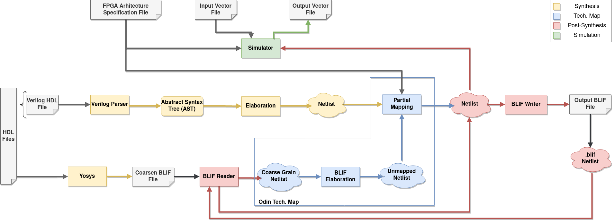

Contributing
============

The Odin-II team welcomes outside help from anyone interested.
To fix issues or add a new feature submit a PR or WIP PR following the provided guidelines.
The instruction for Yosys+Odin-II contribution is similar to Odin-II.
For more information about how to contribute and make a WIP pull request please see the Odin-II `contribution documentation <https://docs.verilogtorouting.org/en/latest/odin/dev_guide/contributing/#contributing>`_.

Yosys+Odin-II's Flow
====================

Yosys+Odin-II functions via two CAD tools, Yosys and Odin-II, by executing a set of steps determined by the files and arguments passed in.
The figure below illustrates the synthesis flow of Odin-II, Yosys, and Yosys+Odin-II if a Verilog file is passed, with an optional FPGA Architecture Specification File.
The Yosys+Odin-II synthesis process includes: reading the HDL file and performing a coarse-grained synthesis by Yosys, elaborating the generated coarse-grained netlist by Odin-II, and ultimately performing partial technology mapping and unused logic removal with the FPGA architecture awareness again by Odin-II. 
The simulator is only activated if an input vector file is passed in which creates the output vector file.

Fine-grained BLIF files, usually generated by Odin-II, being passed in are only used for simulation; no partial mapping takes place.
However, the partial mapping can be performed on coarse-grained BLIF netlists, specified by the ``--coarsen`` command argument.
The flow is depicted in the figure below.

    
**Figure 1** - The Odin-II and Yosys+Odin-II Synthesis Flow

.. code-block:: tcl

	# FILE: $VTR_ROOT/ODIN_II/regression_test/tools/synth.tcl #
	yosys -import

	# the environment variable VTR_ROOT is set by Odin-II.
	# Feel free to specify file paths using "$env(VTR_ROOT)/ ..." 

	# Read the hardware decription Verilog
	read_verilog -nomem2reg -nolatches PATH_TO_VERILOG_FILE.v;
	# Check that cells match libraries and find top module
	hierarchy -check -auto-top;

	# Make name convention more readable
	autoname;
	# Translate processes to netlist components such as MUXs, FFs and latches
	procs; opt;
	# Extraction and optimization of finite state machines
	fsm; opt;
	# Collects memories, their port and create multiport memory cells
	memory_collect; memory_dff; opt;

	# Looking for combinatorial loops, wires with multiple drivers and used wires without any driver.
	check;
	# resolve asynchronous dffs
	techmap -map $VTR_ROOT/ODIN_II/techlib/adff2dff.v;
	techmap -map $VTR_ROOT/ODIN_II/techlib/adffe2dff.v;
    # To resolve Yosys internal indexed part-select circuitry
    techmap */t:$shift */t:$shiftx;

	## Utilizing the "memory_bram" command and the Verilog design provided at "$VTR_ROOT/ODIN_II/techlib/mem_map.v"
	## we could map Yosys memory blocks to BRAMs and ROMs before the Odin-II partial mapping phase.
	## However, Yosys complains about expression widths more than 24 bits.
	## E.g. reg [63:0] memory [18:0] ==> ERROR: Expression width 33554432 exceeds implementation limit of 16777216!
	## Although we provided the required design files for this process (located in ODIN_II/techlib), we will handle
	## memory blocks in the Odin-II BLIF elaborator and partial mapper. 
	# memory_bram -rules $VTR_ROOT/ODIN_II/techlib/mem_rules.txt
	# techmap -map $VTR_ROOT/ODIN_II/techlib/mem_map.v; 

	# Transform the design into a new one with single top module
	flatten;
	# Transforms pmux into trees of regular multiplexers
	pmuxtree;
    # To possibly reduce words size
    wreduce;
	# "undirven" to ensure there is no wire without drive
    # "opt_muxtree" removes dead branches, "opt_expr" performs constant folding,
    # removes "undef" inputs from mux cells, and replaces muxes with buffers and inverters.
    # "-noff" a potential option to remove all sdff and etc. Only dff will remain
	opt -undriven -full; opt_muxtree; opt_expr -mux_undef -mux_bool -fine;;;
	# Make name convention more readable
	autoname;
	# Print statistics
	stat;
	# Output BLIF
	write_blif -param -impltf TCL_BLIF;

**Algorithm 1** - The Yosys+Odin-II Tcl Script File

Yosys Elaboration
-----------------

Yosys, as an open synthesis suite, reads the input digital circuits and creates the corresponding data structures, such as netlist and Abstract Syntax Tree (AST).
As shown in Algorithm 1, the Tcl script, including the step-by-step generic coarse-grained synthesis commands required to be run by Yosys, is available at ``$VTR_ROOT/ODIN_II/regression_test/tools/synth.tcl``.
Utilizing these commands for the Yosys API inside the Odin-II codebase, the Yosys synthesizer performs the elaboration of the input digital design.
The generic coarse-grained synthesis commands includes: 

1. Parsing the hardware description Verilog files. The option ``-nomem2reg`` prevents Yosys from exploding implicit memories to an array of registers. The option ``-nolatches`` is used for both VTR primitives and input circuit design to avoid Yosys generating logic loops.
2. Checking that the design cells match the libraries and detecting the top module using ``hierarchy``.
3. Translating the processes to netlist components such as multiplexers, flip-flops, and latches, by the ``procs`` command.
4. Performing extraction and optimization of finite state machines by the ``fsm`` command.
5. Collecting memories and their ports, then creating a multiport memory cell, by the ``memory_collect`` command.
6. Converting asynchronous memory ports to synchronous ones by merging ports and the related DFFs at their interfaces, using the ``memory_dff`` command.
7. Checking for errors like combinatorial loops, wires with multiple drivers and used wires without any driver by the ``check`` command.

After performing basic synthesis steps, the ``techmap`` command with the input ``adff2dff`` transforms DFFs with asynchronous reset to the synchronous form using the design provided by Yosys.
The next command follows the same approach but with a modified version of the provided design file for DFFs with asynchronous reset and synchronous data enable signals.
The last techmap command is in place to resolve the Yosys internal circuitries designed specifically for indexed part-select Verilog code.
Since this step is mainly related to the Verilog elaboration, we ask Yosys to transform the ``$shift`` and ``$shiftx`` sub-circuits into a more straightforward representation.

The ``flatten`` command generates an output netlist with only one module, representing the HDL circuit design's top module.
The ``pmuxtree`` pass is used to transforms `pmux`, a sub-circuit representing parallel cases, into trees of regular multiplexers.
The option ``wreduce`` performs possible word size reduction for operations to avoid propagating additional signals to the subsequent phases.
In the ``autoname`` passes, Yosys generates an easy-to-read BLIF file by transforming signal names into a shorter format.
This command removes some debugging information, such as the path to the source file, that Yosys inserts in names by default and generally gives easier-to-interpret names.

Then, the optimization pass is called to make the netlist ready for output.
The option ``undriven`` ensures that all nets without a driver are removed, while the ``full`` optimization option is used to remove duplicated inputs in `AND`, `OR` and `MUX` gates.
The ``opt_muxtree`` removes dead branches, ``opt_expr`` performs possible constant folding, in addition to removing ``undef`` inputs from mux cells and transforming muxes into buffers and inverters.
Ultimately, we use the ``write_blif`` command to output the coarse-grained BLIF file.
The option ``param`` prints some additional information about logic cells into the BLIF file, and the ``impltf`` option conceals the definition of primary netlist ports, i.e., VCC, GND and PAD, in the output.

.. note::

	As earlier mentioned in :ref:`user_guide`, the Yosys BLIF output process, i.e., ``write_blif``, is handled by Yosys embedded API inside the Odin-II codebase. As a result, the last command is not required if a user would like to run the Yosys+Odin-II synthesizer using the Tcl script.

BLIF Reader and Building the Netlist
------------------------------------

In this step, Odin-II reads the Yosys generated coarse-grained BLIF file and creates the corresponding netlist data structure.
Previously, the simulation option was only available when a BLIF file was passed to Odin-II.
However, the option for performing the partial mapping phase on input BLIF files have become available with the Yosys+Odin-II integration.
Using the ``--elaborator yosys`` command argument, the Odin-II BLIF reader reads the Yosys generated coarse-grained BLIF file.
Additionally, if a coarse-grained BLIF file is already created, the user can perform Odin-II partial mapping on that using the ``-b design.blif --coarsen`` command arguments. 

.. note::

	The netlist can be viewed via graphviz using the command ``-G``. The file will appear in the main directory under ``net.dot``.

BLIF Elaboration
----------------

As depicted in Yosys+Odin-II synthesis flow, the difference between fine-grained and coarse-grained netlists is the BLIF elaboration and partial mapping phases in Odin-II technology mapping flow.
Technically, the infrastructure of Odin-II and Yosys differ from each other. 
As a result, the elaboration phase is performed on the input netlist when the input BLIF file is specified as a coarse-grained design to make it compatible with Odin-II partial mapper.
As an example, Yosys generates complex DFFs, such as DFF with synchronous enable and reset, while Odin-II partial mapper only recognizes the simple DFF represented by ``.latch`` in BLIF. 
Therefore, these complex modules are required to be transformed into simpler designs using standard logic cells.

Partial Technology Mapping
--------------------------

During the partial mapping, Odin-II maps the logic using an architecture.
If no architecture is passed in, Odin-II will create the soft logic and use LUTs for mapping.
However, if an architecture is passed, Odin-II will map accordingly to the available hard blocks and LUTs.
It uses a combination of soft logic and hard logic.

With the integration of Yosys+Odin-II, the Odin-II partial mapping features such as hard/soft logic trade-offs become available for a Yosys elaborated circuit.
For instance, using optimization command arguments, a user can force the partial mapper to infer at least a user-defined percentage of multipliers in soft logic.

Simulator
---------

The simulator of Odin-II takes an input vector file and creates an output vector file determined by the behaviour described in the Verilog file or BLIF file.
This section is comprehensivly decribed in the Yosys+Odin-II :ref:`user_guide` and the Odin-II `Simulation Arguments <https://docs.verilogtorouting.org/en/latest/odin/user_guide/#simulation-arguments>`_.
