# Cell, BEL and Site Design

One of the key concepts within the FPGA interchange device resources is the
relationship between the cell library and the device BEL and site definitions.
A well designed cell library and a flexible but concise BEL and site
definition is important for exposing the hardware in an efficient way that
enables a place and route tool to succeed.

Good design is hard to capture, but this document will talk about some of the
considerations.

### Assumptions about cell placement and driver BEL pins

One important note is that BELs represent a placable location for a cell, and
only one cell should be placable at a given BEL.  This means that the cell
library design and BEL design strongly affects what is expressable by the
place and route tool.  There will be some examples highlighted below that
expand on how this is important and relevant when discussing concrete
examples.

## Granularity of the cell library

It is important to divide the place and route problem and the synthesis
problem, at least as defined for the purpose of the FPGA interchange.  The
synthesis tool operates on the **cell library**, which should be designed to
expose logic elements at a useful level of granularity.

As a concrete example, a LUT4 element is technically just two LUT3 elements,
connected by a mux (e.g. MUXF4), a LUT3 element is just two LUT2 elements,
connected by a mux (e.g. MUXF3), etc. If the outputs of those interior muxes
are not accessible to the place and route tool, then exposing those interior
function muxes as cells in the cell library is not as useful.

Cell definitions should be granular enough that the synthesis can map to
them, but not so granular that the place and route tool will be making few if
any choices.  If there is only one legal placement of the cell, it's value is
relatively low.

## Drawing site boundaries

When designing an FPGA interchange device resource for a new fabric, one
important consideration is where to draw the site boundary.  The primary goal
of lumping BELs within a site is to capture some local congestion due to
fanout limitations.  Interior static routing muxes and output muxes may
accommodate significantly fewer signals than the possible number of BELs that
drive them.  In this case, it is important to draw the site boundary large
enough to capture these cases so as to enable the local congestion to be
resolved during either packing for clustered approaches, or during placement
during unclustered approaches.  In either case, local congestion that is
strongly placement dependant must be resolved prior to general routing,
unless a fused placement and routing algorithm is used.

### FF control sets routing

A common case worth exploring is FF control sets, e.g. SR type signals and CE
type signals.  In most fabric SLICE types, the SR and CE control signals are
shared among multiple rows of the SLICE.  This is a common example of local
site congestion, and the site boundary should typically encompass all BELs
that share this kind of local routing for all the reasons discussed above.

Another consideration with control signals is the presence of control signal
constraints that cannot be expressed as local routing congestion.  For
example, if a set of BELs share whether the SR control line is a set or reset
(or async set or async reset), it is common to expand the site boundary to
cover the BELs that share these implicit configurations.  The constraint
system in the device resources is designed to handle this kind of non-routing
driven configuration.

## Drawing BEL boundaries

BEL definitions require creating a boundary around primitive elements of
the fabric.  The choice of where to place that boundary has a strong influence
on the design of the cell library in the FPGA interchange.

In general, the smaller the BEL boundary, the more complexity is exposed to
the place and route tool.  In some cases exposing this complexity is
important, because it enables some goal.  For example, leaving static routing
muxes outside of BELs enables a place and route tool to have greater
flexibility when resolving site congestion.  But as a counter point, if only
a handful of static mux configurations are useful and those choices can be
made at synthesis time, then lumping those muxes into synthesis reduces the
complexity required in the place and route tool.

The most common case where the static routing muxes are typically lumped into
the BEL is BRAM's and FIFO's address and routing configuration.  At synthesis
time, a choice is made about the address and data widths, which are encoded as
parameters on the cell.  The place and route tool does not typically make
meaningful choices on the configuration of those static routing muxes, but
they do exist in the hardware.

The most common case where the static routing muxes are almost never lumped
into the BEL is SLICE-type situations.  The remainder of this document will
show examples of why the BEL boundary should typically exclude the static
routing muxes, and leave the choice to the place and route tooling.

## Static routing muxes and bitstream formats

Something to keep in mind when drawing BEL boundaries to include or exclude
static routing muxes is the degree of configurability present in the
underlying bitstream.  Some static routing muxes share configuration bits in
the bitstream, and so expressing them as two seperate static routing muxes
potentially gives the place and route tool flexibility than the underlying
fabric cannot express.  This will result in physical netlists that cannot be
converted to bitstream.

In some cases this can be handled through tight coupling of the cell and
BEL library.  The idea is to limit cell port to BEL pin mappings that avoid
illegal static routing mux configurations.  This approach has its limits.
In general, considering how the bitstream expresses static routing muxes must
be accounted for when drawing BEL boundaries.

### Stratix II and Stratix 10 ALM

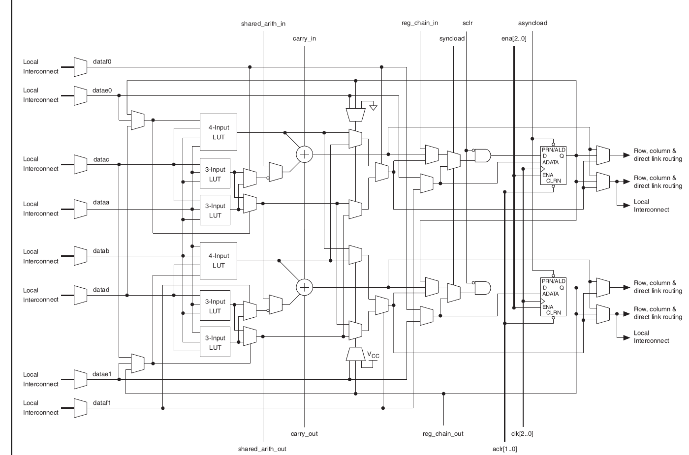

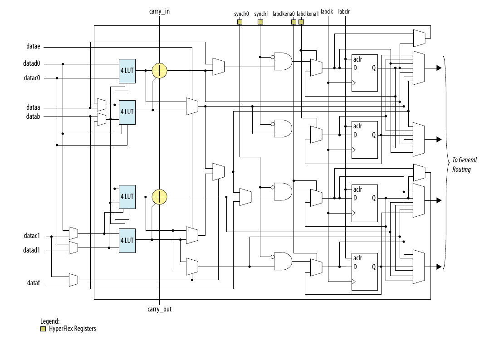

Consider both Stratix II and Stratix 10 logic sites.  The first thing to note
is that the architectures at this level are actually mostly the same.  Though
it isn't immediately apparent, both designs are structured around 4 4-LUT
elements.

Take note that of the following structure:

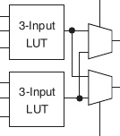

This is actually just two LUT4 elements, where the top select line is
independent.

See the following two figures:

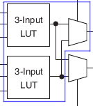
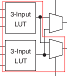

In Stratix 10, the LUT4 element is still present, but the top select line
fracturing was removed.

So now consider the output paths from the the 4 LUT4 elements in the Stratix
II site.  Some of the LUT4 outputs route directly to the carry element, so it
will be important for the place and route tool be able to place a LUT4 or
smaller to access that direct connection.  But if the output is not used in
the carry element, then it can only be accessed in Stratix II via the MUXF5
(blue below) and MUXF6 (red below) elements.

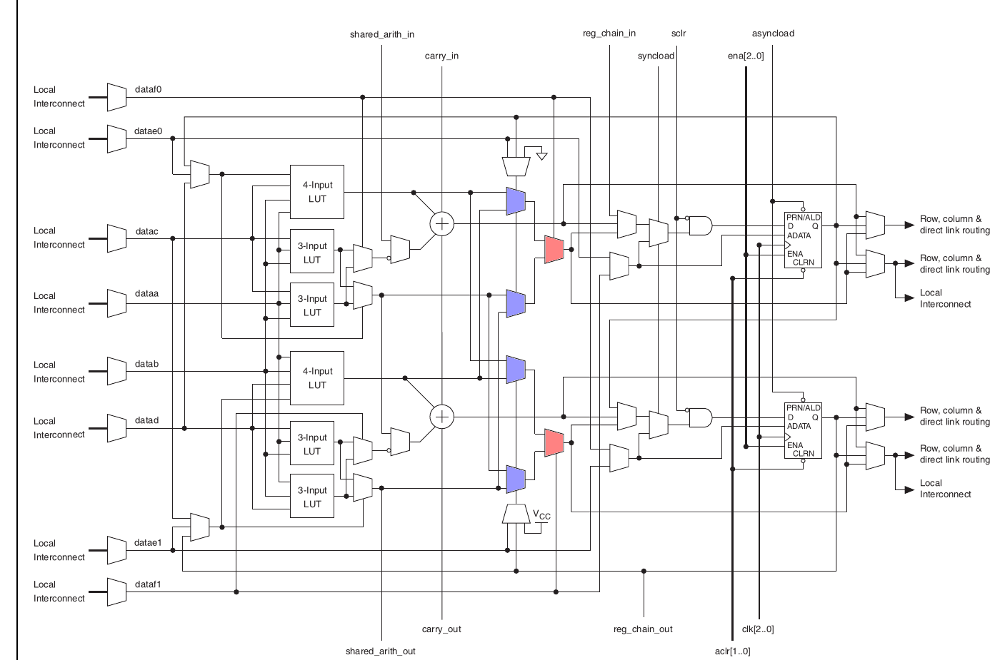

So given the Stratix II site layout, the following BELs will be required:

 - 4 LUT4 BELs that connect to the carry
 - 2 LUT6 BELs that connect to the output FF or output MUX.

The two LUT6 BELs are shown below:

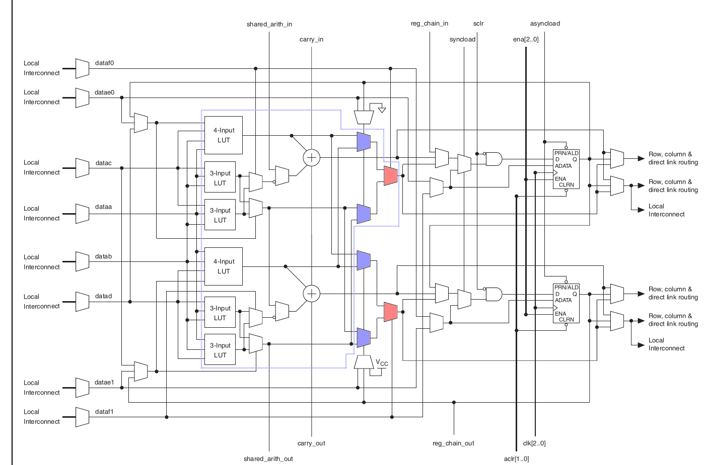
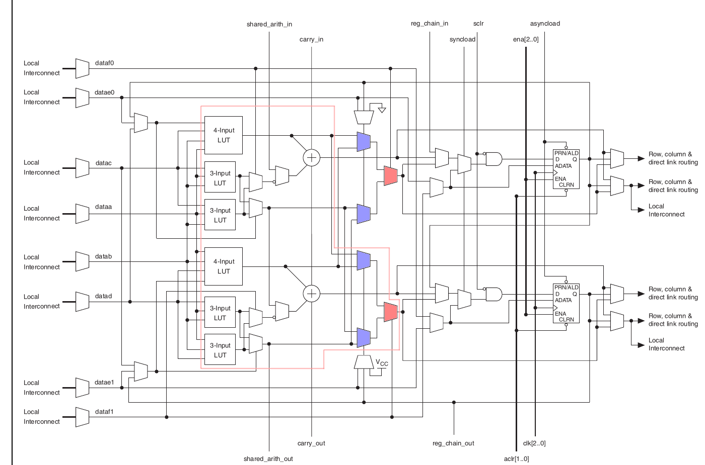

Drawing a smaller BEL boundary has little value, because a LUT5 element would
still always require routing through the MUXF6 element.

Now consider the Stratix 10 output arrangement.  The LUT4 elements direct to
the carry element is the same, so those BELs would be identical.  The Stratix
10 site now has an output tap directly on the top LUT5, similiar to the Xilinx
Versal LUT6 / LUT5 fracture setup.  See diagram below.  LUT5 element is shown
in blue, and LUT6 element is shown in red.

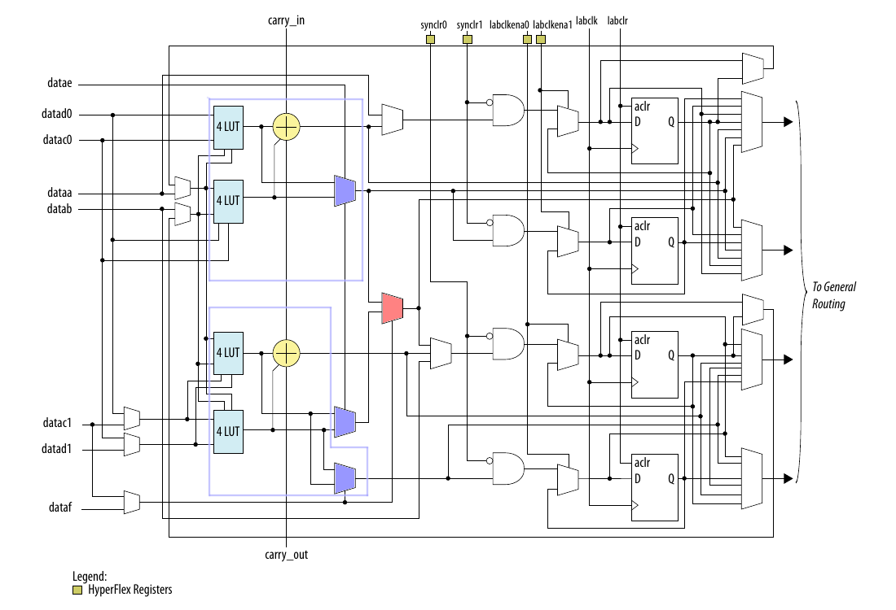
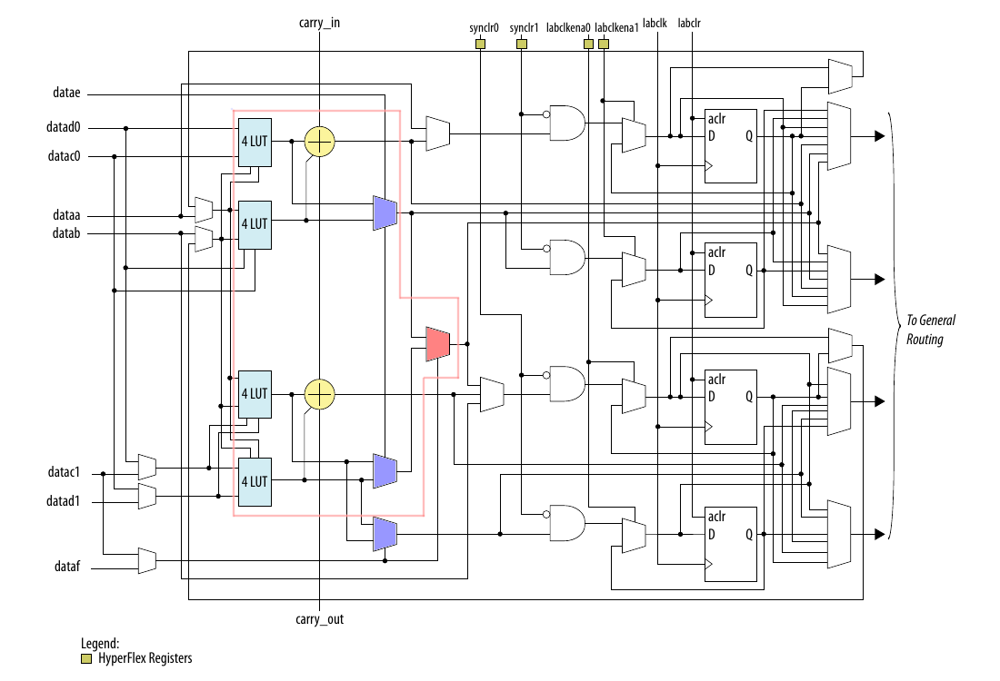

So given the Stratix 10 site layout, the following BELs will be required:

 - 4 LUT4 BELs that connect to the carry
 - 2 LUT5 BELs that connect to the output FF or output MUX
 - 1 LUT6 BELs that connect to the output FF or output MUX

### Versal ACAP

The Versal ACAP LUT structure is fairly similiar to the Stratix 10 combitorial
elements.

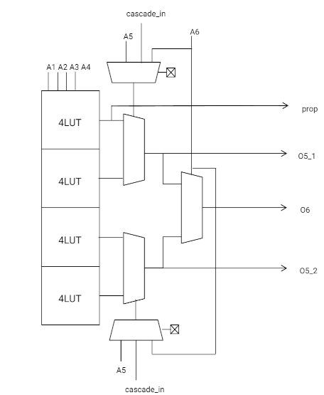

Unlike the Stratix 10 ALM, it appears only 1 of the LUT4's connects to the
carry element (the prop signal).  The O6 output also has a dedicate
connection to the carry.  See image below:

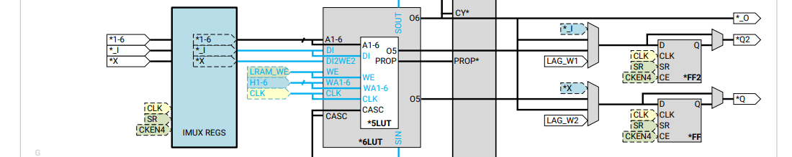

The Versal LUT structure likely should be decomposed into 4 BELs, shown in
the next figures:

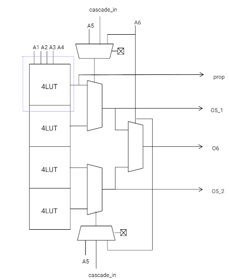
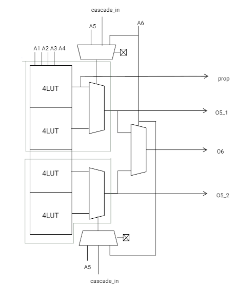
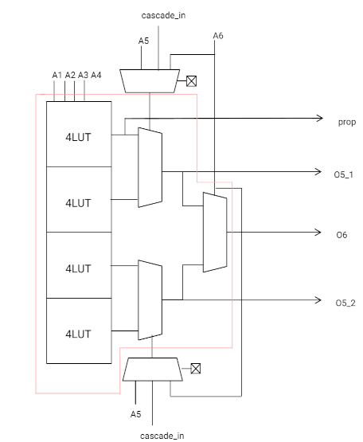

So given the Versal site layout, the following BELs will be required (per SLICE row):

 - 1 LUT4 BELs that connect to the carry
 - 2 LUT5 BELs that connect to the output FF or output MUX
 - 1 LUT6 BELs that connect to the output FF or output MUX

#### Implication of a wider BEL definition

Consider the Versal structure, but instead of drawing four BELs per row, only have two
BELs per row.  One BEL has the `O5_1` and `prop` output BEL pins and the
other BEL has the `O6` and `O5_2` BEL pin.  In this configuration, if the cell
library does not expose a cell that maps to both the `O5_1` and `prop` output
BEL pins, then it will not be possible to map LUTs that leverage both output
BEL pins.

In theory, the cell port to BEL pin map could map the output pin of a LUT4
element to both the `prop` and `O5_1` output BEL pins, but then there will be
two output BEL pins driving the net connected to the cell port.  Having
multiple BEL pins driving one net is not legal, except for the global logic 0
and 1.

### Quicklogic EOS S3 logic cell

The Quicklogic EOS S3 logic cell has an interesting LUT design because there
is not LUT element specifically.  Instead, the fabric exposes a 8x3 mux, with
inverters at each of the mux inputs, see figure below:

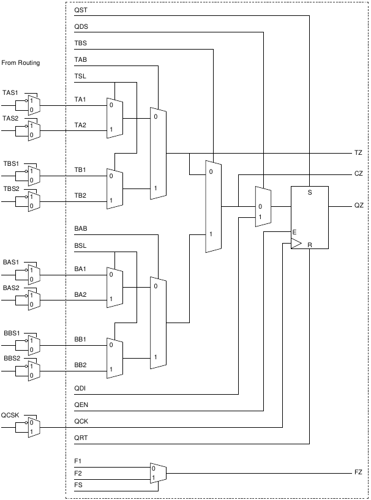

The way to approach this fabric is to first draw BEL boundaries around the 4x2
mux and 8x3 mux present in the fabric:

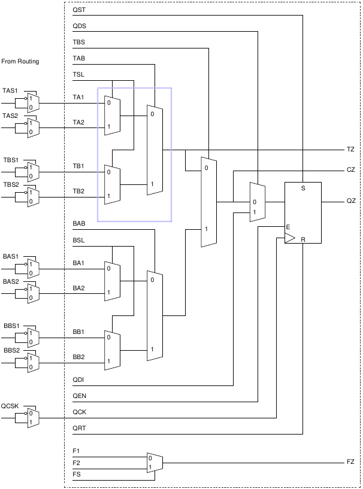
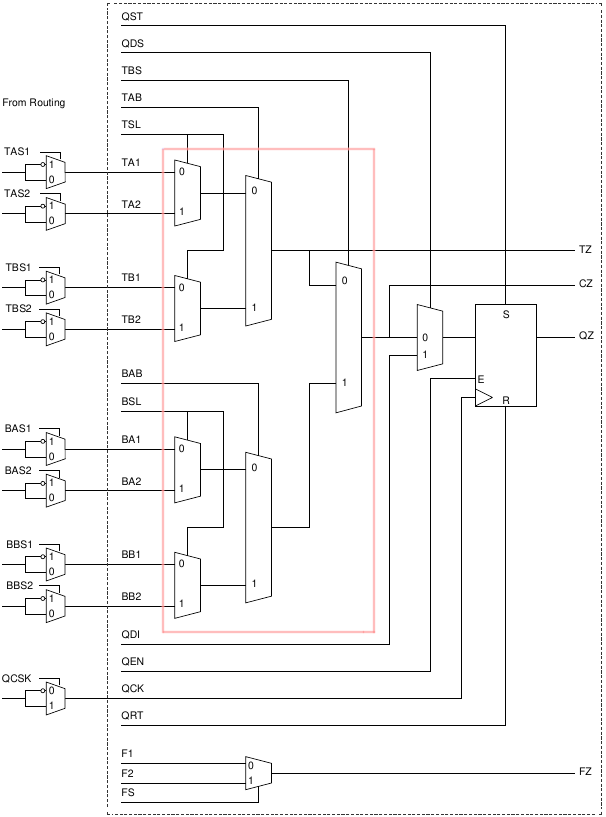

The cell library should have
3 MUX cell types:
 - 4-input 1-output 2-select MUX4x2 (maps to MUX4x2 BEL and MUX8x3 BEL)
 - 8-input 1-output 3-select MUX8x3 (maps to MUX8x3 BEL)
 - A macro cell that is 2x (4-input 1-output 2-select MUX4x2) 2xMUX4x2 (maps to MUX4x2 *and* MUX8x3 BEL)

A fourth most general cell type is possible, which is to add a cell that also
has a cell port that maps to `TBS`, instead of tying `TBS` high as the
2xMUX4x2 cell would do. It is unclear how useful such a cell would be.
However given the BEL boundaries, adding such a cell would be easy after the
fact.

In all of the cells above, all inputs to the muxes have statically
configured inverters.

So the question becomes, how to model LUT cells in this fabric?  The LUT cells
should be the regular LUT1, LUT2 and LUT3 cells.  The LUT1 and LUT2 can map to
either the MUX4x2 or MUX8x3 BEL.  The LUT3 can map to only the MUX8x3 BEL.
The question is only what is the cell port to BEL pin map?

The solution is when mapping a LUT cell, to tie all of the MUX BEL pins to VCC
(or GND, whatever the default is) before the inverter.  The place and route
tool can treat the BEL as a regular LUT, and only the bitstream generation
step will need to be aware that the inversion control is being used to
encode the LUT equation.

This configuration allows most (if not all) of the logic to be available
to the place and route tool, without exposing unneeded complexity.
