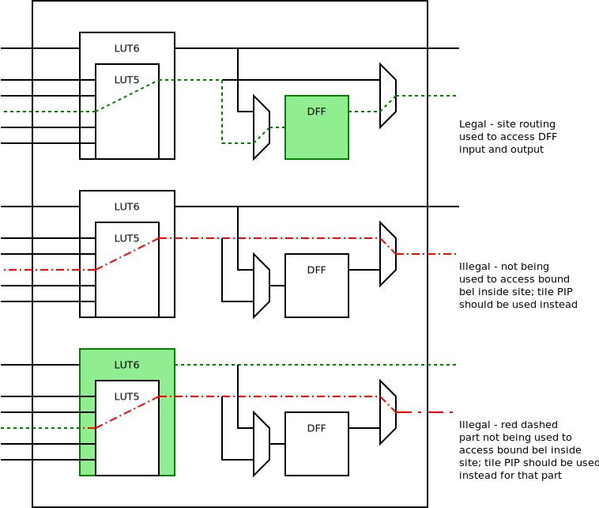

# Device Resources

The device resources schema is intended to be a complete description of an
island-based FPGA design.  It is made of many components, but the core
description of the device is shown below.

```
┌─────────────────┐
│  Device         │
│ ┌─────────────┐ │
│ │ Tile        │ │
│ │ ┌─────────┐ │ │
│ │ │ Site    │ │ │
│ │ │ ┌─────┐ │ │ │
│ │ │ │ BEL │ │ │ │
│ │ │ └─────┘ │ │ │
│ │ │         │ │ │
│ │ └─────────┘ │ │
│ │             │ │
│ └─────────────┘ │
│                 │
└─────────────────┘
```

That is:
 - A device contains tiles
 - Tiles contains sites
 - Sites contains BELs

The schema contains the required information to answer questions such as:
 - Where are tiles located?
 - How are sites connected to the routing graph?
 - How are BELs connected to the boundary of the site?
 - How can cells be placed at BELs?

## Terminology

- Device - A set of tiles and package pins.
- Tiles - An instance of a tile type which contains wires and sites
- Package pin - A boundry between the "interior" of the device and what is "outside" the package.  Generally corresponds to a pin on a package, e.g. pin 1 on SOP-8 or A1 on CSG324.
- Wire - Also known as a "tile wire" .  A wire is a piece of conductive material totally contained within a tile.  Wires can be part of nodes.  Wires can connect to PIPs or site pins.
- Node - A node is a set of 1 or more wires that are connected.  Nodes can span multiple tiles.  Nodes connect to PIPs or site pins via the wires that are part of the node.
- PIP - PIP is an abbreviation for programable interconnect point.  A PIP provides a connection between two wires.  PIPs can be unidirectional or bidirectional.  Unidirectional PIPs always connect wire0 to wire1.  Bidirectional PIPs can connect wire0 to wire1 or wire1 to wire0.
- Site - A collection of site pins, site wires and BELs.
- Site pin - The connection between a site and a wire. Site pins may connect to 0 or more site port BELs.
- Site wire - A piece of conductive material that connects to at most 1 output BEL pin and 0 or more input or inout BEL pins.
- BEL - BEL is an abbreviation of basic logic element.  A BEL can be one of 3 types, site port, logic, routing.  A BEL contains 1 or more BEL pins.
- BEL pin - A connection between a BEL and a site wire.
- Logic BEL - A placable logic element.  May be subject to 0 or more placement constraints.
- Site port BEL - A site port BEL represents a connection to a site pin contained within the parent tile of the site.  See [Site port BEL](#site_port_bel).
- Routing BEL - A routing BEL connects at most 1 input BEL pin to the output BEL pin.  See [Routing BEL](#routing_bel).
- Site PIP - A pair of input and output BEL pins belonging to a BEL that represents a logically connection.
- Cell - A logical element of a design that contains some number of cell ports and some number of cell instances, and some number of nets.
- Cell port - The boundary between the interior of a cell and the containing cell (if any).
- Cell instance - A instance of a cell.  The cell ports of may be connected to nets within the parent cell.
- Net - A set of logically connected cell ports.

## The place and route problem

The device resources schema is intended to provide a description for a tool
solving the place and route problem. The definition of the problem used by
this schema is described below:

There exists exactly 1 **cell instance** (the **top** instance) that contains 1 or
more leaf **cell instances** that must be placed at **BELs**, such that no
**constraints** are violated and the **nets** between the **cell instances** are
**routable**. **Routable** means that **site wires**, **site PIPs**,  **nodes**, **PIPs**
can be assigned to at most 1 **net** such that each **net driver BEL pin** can
reach each every **net sink BEL pin** on the **net**.

The device resource format describes how **cell instances** can be legally
placed at **BELs** and how **cell pins** relate to **BEL pins**.  When a
**cell instance** is placed at a **BEL**, it may be subject to 0 or more
**constraints**.

**Nets** are divided into 3 categories.  A **signal** net represents a signal
that is not either the constant logical 0 or constant logical 1 net.
The constant logical 0 and constant logical 1 nets are special because they
can have multiple drivers in the device description.  Routing resources that
are always part of the constant logical 0 or constant logical 1 net are
explicitly defined in the device resources schema.  The constant logical 0 net
is listed in the schema as the "gnd" type.  The constant logical 1 net is
listed in the schema as the "vcc" type.

### Rules for routing

Fully routed signal nets always begin at a output/inout BEL pin, and always
end at an input/inout BEL pin.  If a net enters a site, that net **must** end
at an input/inout BEL pin.  It is not legal for a net to enter and leave a
site.  If such a path is required, a pseudo PIP should be added to the schema.

## Site example

The following is an example site for a SLICE for a non-existent device.

```
                                ▲
                              CO│                                     │
     ┌──────────────────────────┼─────────────────────────────────────┼──────┐
     │                          │                                     │      │
   B0│   I0┌───────┐            │                  BLUT ┌───────┐     ▼ CLK  │
─────┼────►│       │   ┌────────o─────────────────┬────►│       │   ┌────┐   │
   B1│   I1│       │O  │        │                 │XOR  │       │D D│    │Q  │ FFOUT
─────┼────►│ BLUT3 ├───┤        │     ┌────────┬──o────►│ FFMUX ├──►│ FF ├───┼───►
   B2│   I2│       │   │        │     │        │  |ALUT │       │   │    │   │
─────┼────►│       │   │        │     │  ┌──┬──o──o────►│       │   └────┘   │
     │     └───────┘   │    ┌───┴───┐ │  │  │  │  │     └───────┘            │
     │                 │  SI│       │ │  │  │  │  │                          │
     │                 └───►│       ├─┘  │  │  │  │                          │
     │                    DX│ CARRY │ O  │  │  │  │                          │
     │                 ┌───►│       │    │  │  │  │                          │
   A0│   I0┌───────┐   │    └───┬───┘    │  │  │  │      ┌────────┐          │
─────┼────►│       │   │        │        │  │  │  │ BLUT │        │          │
   A1│   I1│       │O  │        │        │  │  │  └─────►│        │OUT       │ OUT
─────┼────►│ ALUT3 ├───┴────────o────────┘  │  │    XOR  │ OUTMUX ├──────────┼────►
   B2│   I2│       │            │           │  └────────►│        │          │
─────┼────►│       │            │           │       ALUT │        │          │
     │     └───────┘            │           └───────────►└────────┘          │
     │                          │                                            │
     │                          │                                            │
     └──────────────────────────┼────────────────────────────────────────────┘
                              CI│
                                │
```

In the above example, there are 17 BELs:

| BEL Name | Category  | # Input | # Output |
|----------|-----------|---------|----------|
| ALUT3    | Logic     | 3       | 1        |
| BLUT3    | Logic     | 3       | 1        |
| CARRY    | Logic     | 3       | 2        |
| FF       | Logic     | 2       | 1        |
| FFMUX    | Routing   | 3       | 1        |
| OUTMUX   | Routing   | 3       | 1        |
| A0       | Site port | 0       | 1        |
| A1       | Site port | 0       | 1        |
| A2       | Site port | 0       | 1        |
| B0       | Site port | 0       | 1        |
| B1       | Site port | 0       | 1        |
| B2       | Site port | 0       | 1        |
| CI       | Site port | 0       | 1        |
| CLK      | Site port | 0       | 1        |
| CO       | Site port | 1       | 0        |
| FFOUT    | Site port | 1       | 0        |
| OUT      | Site port | 1       | 0        |

Each site port BEL has a site pin, so the site pins are:

| Site Pin Name | Direction |
|---------------|-----------|
| A0            | In        |
| A1            | In        |
| A2            | In        |
| B0            | In        |
| B1            | In        |
| B2            | In        |
| CI            | In        |
| CLK           | In        |
| CO            | Out       |
| FFOUT         | Out       |
| OUT           | Out       |

The BEL BLUT3 has 4 BEL pins:

| BEL pin name | Direction |
|--------------|-----------|
| I0           | In        |
| I1           | In        |
| I2           | In        |
| O            | Out       |

The BEL A0 has 1 BEL pin:

| BEL pin name | Direction |
|--------------|-----------|
| A0           | Out       |

The BEL OUTMUX has 4 BEL pins:

| BEL pin name | Direction |
|--------------|-----------|
| BLUT         | In        |
| XOR          | In        |
| ALUT         | In        |
| OUT          | Out       |


There are 12 site PIPs:

| BEL name | In pin | Out pin |
|----------|--------|---------|
| BLUT3    | I0     | O       |
| BLUT3    | I1     | O       |
| BLUT3    | I2     | O       |
| ALUT3    | I0     | O       |
| ALUT3    | I1     | O       |
| ALUT3    | I2     | O       |
| FFMUX    | ALUT   | D       |
| FFMUX    | XOR    | D       |
| FFMUX    | BLUT   | D       |
| OUTMUX   | ALUT   | OUT     |
| OUTMUX   | XOR    | OUT     |
| OUTMUX   | BLUT   | OUT     |


The site wire BLUT3\_O has 4 BEL pins:

| BEL Name | Pin  |
|----------|------|
| BLUT3    | O    |
| CARRY    | SI   |
| FFMUX    | BLUT |
| OUTMUX   | BLUT |

The site wire B0 has 2 BEL pins:

| BEL Name | Pin |
|----------|-----|
| B0       | B0  |
| BLUT3    | I0  |

## Details

### Net routing summary

Each net start at the driver output/inout BEL pin.  The BEL pin will be
connected to exactly 1 site wire.  If the net sink can be reached within the
site, then the net can use site PIPs to reach a site wire connected to the
input/inout BEL pin.

If the net sink is in another site, then the net must first reach a site port
input BEL pin using site PIPs to reach the site wire connected to the site
port. From there the net leaves the site via the site port and is now on the
first node via the site pin matching the site port.

From there the net must use PIPs to expand to new nodes until arriving at a
node attached to valid site pin for the sink.  This would be a site pin that
is part of the same site that the sink BEL is part of, and that the site port
wire can reach the sink BEL pin (via 0 or more site PIPs). The site can be
entered via the site port corresponding to the site pin. The first site wire
in the site will be the site wire attached to the output BEL pin of the site
port.  From there site routing continues per above.


### Use of site PIPs

It is important to note that site PIPs can only be used to access placed cells
inside that site. Site PIPs cannot be used as general route-thrus, to route
from site input to output. General route-thrus across entire sites should use
tile pseudo PIPs as described below - even if a site pin is being validly used
for one sink pin of a net that is located inside the site; site PIPs cannot
also be used to leave the site again to reach other sinks.

LUT route-thrus, for example, might require both site PIPs and tile pseudo
PIPs. The site PIP would be used to route through the LUT in order to access
an associated flipflop input inside the site. The tile PIP would be used to
route across the entire site as part of the general, inter-tile, routing
problem.

A diagram illustrating the legal and illegal uses is shown below.



### Tile Types and site types

To reduce data duplication in the device schema, both tiles and sites have a
type.  Most of the definition of the tile and site is in the type rather than
repeated at each instance.  This does cause some more complicated
indirection, so the following section provides some additional explanation
here.

#### Sites, site types and alternative site types

The most complicated relationship in the schema is likely the relationship
between sites, site types and alternative site types.

Most of the site type description is independent of the tile / tile type that
the site type is within.  See the "SiteType" struct definition for
the independent portion of the schema. The important exception is the
relationship between wires and site pins.

Each site within a tile has a "primary site type", which is found in the
"SiteTypeInTileType" struct definition, contained in the "TileType" struct.
The site within the tile will specify which "SiteTypeInTileType" to use for
that particular site.

The primary site type contains a list of "alternative" site types that may be
used ("altSiteTypes" in "SiteType").  The primary site type must always
contains the complete list of site pins used in any of the alternative site
types.

The site pins to wire relationship is always done via the primary site type.
When an alternative site type is used, the site pins of that alternative site
type must be first be mapped to a site pin of the primary site type.

The "SiteTypeInTileType" defines the relationship between the primary site
type and the wires.  It also defines the relationship from the alternative
site type to the primary site type.

It first defines the primary site type ("primaryType").  It defines a map
between the site pins in the primary site type and wires in the tile type that
contains the site ("primaryPinsToTileWires").  Last it defines
the map between the alternative site pin and the primary site pin
("altPinsToPrimaryPins").

Important: When solving the place and route problem, only the primary or one
of the alternative site types can be used at a time for a particular site.

### <a name="routing_bel">Routing BEL

A routing BEL represents statically configurable site routing by connecting a
site wire connected to one of the input BEL pins to the output BEL pin of
the BEL.  Routing BELs must have 1 output BEL pin.

#### Inverting routing BELs

Some routing BELs can invert signals that pass through them.  Defined the
"inverting" field in the "BEL" struct with the BEL pins that invert and do
not invert.

### <a name="site_port_bel">Site port BEL

A site port BEL represents a connection to a site pin contained within the
parent tile of the site. Site port BELs have exactly 1 BEL pin.  The BEL name
and pin name should be the same.  The name of the BEL should match the name of
the site pin that the site port connects too.  The direction of the BEL pin
should be the opposite of the site pin direction.

Examples:

An input site pin "I0" would have a site port BEL named "I0" with 1 BEL
output pin named "I0".

## Additional topics

The device resources schema also covers some important data required for
handling common cases found in island based FPGAs.

### Signal inversions

It is fairly common for fabrics to contain site local signal inverters.
Depending on the architecture, the place and route tool may be expected to
leverage inverters or may even require it.  The device resources schemas
provides a description for how cells express inversion and how to use site
local inverters to implement the requested inversion.

### LUT definitions

LUTs are common to every island-based FPGA, and many place and route tasks
depend on having knowledge of how the LUTs are arranged.  The LUT definition
section of the device resources defines where LUTs exist as BELs and what
cells can be placed at those BELs.  This is important is at least two place
and route tasks.  The first is that LUTs can be trivially turned into site pips
from the input of the LUT to the output of the LUT, subject to **constraints**
and LUT equation sharing.  The second is that LUTs can be trivially turned
into constant sources from the output pin.

### Parameters

Some parameters attached to cell instances may be relevant for the place and
route problem.  A common example is LUT equation sharing, which can happen on
fracturable LUTs.  See the schema for details.

### Pseudo PIPs

It may be important within a device to represent PIPs that "route-thru"
one or more BELs.  This can be modelled as placing a cell in a particular
configuration at a BEL, subject to the normal cell placement rules.  The
"PseudoCell" struct defines what resources are used by using PIPs.

All pseudo PIPs must define at least 1 pseudo cell.  Pseudo cells should
include the site port BEL that the pseudo PIP used to enter the site.
