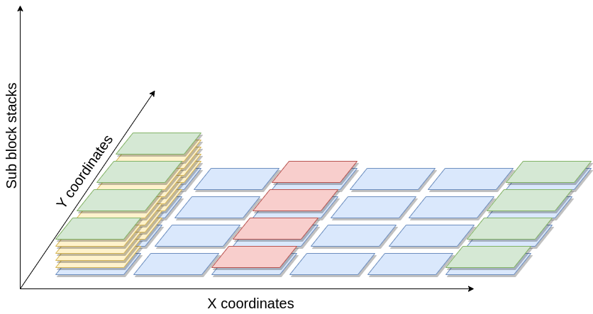
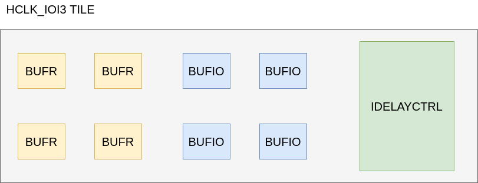

.. _heterogeneous_tiles_tutorial:

Heterogeneous tiles tutorial
============================

This tutorial aims at providing information to the user on how to model sub tiles to enable *heterogeneous tiles* in VPR.

An *heterogeneous tile* is a tile that includes two or more site types that may differ in the following aspects:

- *Block types* (pb_type)
- *Fc* definition
- *Pin locations* definition
- *IO ports* definition

As a result, an *heterogeneous tile* has the possibility of having multiple block types at the same (*x*, *y*) location in the grid.
This comes with the introduction of a third spatial coordinate (sub-block) that identifies the placement of the block type within the x and y grid coordinate.

Moreover, the placer can choose and assign different locations for each block type within the same coordinates as well.

    Device grid, with (x, y, sub-block) coordinates. Each block can be moved by the placer in all the three spatial dimensions.

To correctly model an architecture, each :ref:`arch_tiles` requires at least one sub tile definition. This represents a default
homogeneous architecture, composed of one or many instances of the sub tile within the physical tile (the number of such sub-tiles is referred to as the *capacity*).

To enhance the expressivity of VPR architecture, additional sub tiles can be inserted alongside with the default sub tile.
This enables the definition of the *heterogeneous tiles*.

With this new capability, the device grid of a given architecture does include a new sub-block coordinate that identifies the type of sub tile used and its actual location, in case the capacity is greater than 1.

Heterogeneous tiles examples
----------------------------

Following, there are two examples to illustrate some potential use cases of the *heterogeneous tiles*, that might be of interest to the reader.

.. note:: The examples below are a simplified versions of the real architectural specification.

Sub-tiles with different pin locations
######################################

The Xilinx Series 7 Clock tile is composed of 16 BUFGCTRL sites (pg. 36 of the `7 Series FPGAs
Clocking Resources <https://www.xilinx.com/support/documentation/user_guides/ug472_7Series_Clocking.pdf>`_ guide). Even though they are equivalent regarding the ports and Fc definition, some of the sites differ in terms of pin locations, as depicted by the simplified representation of the Clock tile in :numref:`clock_tile`.

.. _clock_tile:
.. figure:: clock_tile_figure.png

    Simplified view of the Clock tile of the Xilinx Series 7 fabric.

Heterogeneous tiles come in hand to model this kind of tiles and an example is the following:

.. code-block:: XML

    <tiles>
        <tile name="BUFG_TILE">
            <sub_tile name="BUFG_SUB_TILE_0" capacity="1">
                <clock name="I0" num_pins="1"/>
                <clock name="I1" num_pins="1"/>
                <input name="CE0" num_pins="1"/>
                <input name="CE1" num_pins="1"/>
                <input name="IGNORE0" num_pins="1"/>
                <input name="IGNORE1" num_pins="1"/>
                <input name="S0" num_pins="1"/>
                <input name="S1" num_pins="1"/>
                <output name="O" num_pins="1"/>
                <fc in_type="abs" in_val="2" out_type="abs" out_val="2"/>
                <pinlocations pattern="custom">
                    <loc side="top">BUFG_SUB_TILE_0.I1 BUFG_SUB_TILE_0.I0 BUFG_SUB_TILE_0.CE0 BUFG_SUB_TILE_0.S0 BUFG_SUB_TILE_0.IGNORE1 BUFG_SUB_TILE_0.CE1 BUFG_SUB_TILE_0.IGNORE0 BUFG_SUB_TILE_0.S1</loc>
                    <loc side="right">BUFG_SUB_TILE_0.I1 BUFG_SUB_TILE_0.I0 BUFG_SUB_TILE_0.O</loc>
                </pinlocations>
                <equivalent_sites>
                  <site pb_type="BUFGCTRL" pin_mapping="direct"/>
                </equivalent_sites>
            </sub_tile>
            <sub_tile name="BUFG_SUB_TILE_1" capacity="14">
                <clock name="I0" num_pins="1"/>
                <clock name="I1" num_pins="1"/>
                <input name="CE0" num_pins="1"/>
                <input name="CE1" num_pins="1"/>
                <input name="IGNORE0" num_pins="1"/>
                <input name="IGNORE1" num_pins="1"/>
                <input name="S0" num_pins="1"/>
                <input name="S1" num_pins="1"/>
                <output name="O" num_pins="1"/>
                <fc in_type="abs" in_val="2" out_type="abs" out_val="2"/>
                <pinlocations pattern="custom">
                    <loc side="top">BUFG_SUB_TILE_1.S1 BUFG_SUB_TILE_1.I0 BUFG_SUB_TILE_1.CE1 BUFG_SUB_TILE_1.I1 BUFG_SUB_TILE_1.IGNORE1 BUFG_SUB_TILE_1.IGNORE0 BUFG_SUB_TILE_1.CE0 BUFG_SUB_TILE_1.S0</loc>
                    <loc side="right">BUFG_SUB_TILE_1.I0 BUFG_SUB_TILE_1.I1 BUFG_SUB_TILE_1.O</loc>
                </pinlocations>
                <equivalent_sites>
                  <site pb_type="BUFGCTRL" pin_mapping="direct"/>
                </equivalent_sites>
            </sub_tile>
            <sub_tile name="BUFG_SUB_TILE_2" capacity="1">
                <clock name="I0" num_pins="1"/>
                <clock name="I1" num_pins="1"/>
                <input name="CE0" num_pins="1"/>
                <input name="CE1" num_pins="1"/>
                <input name="IGNORE0" num_pins="1"/>
                <input name="IGNORE1" num_pins="1"/>
                <input name="S0" num_pins="1"/>
                <input name="S1" num_pins="1"/>
                <output name="O" num_pins="1"/>
                <fc in_type="abs" in_val="2" out_type="abs" out_val="2"/>
                <pinlocations pattern="custom">
                    <loc side="right">BUFG_SUB_TILE_2.S1 BUFG_SUB_TILE_2.I0 BUFG_SUB_TILE_2.CE1 BUFG_SUB_TILE_2.I1 BUFG_SUB_TILE_2.IGNORE1 BUFG_SUB_TILE_2.IGNORE0 BUFG_SUB_TILE_2.CE0 BUFG_SUB_TILE_2.S0</loc>
                    <loc side="left">BUFG_SUB_TILE_2.I0 BUFG_SUB_TILE_2.I1 BUFG_SUB_TILE_2.O</loc>
                </pinlocations>
                <equivalent_sites>
                  <site pb_type="BUFGCTRL" pin_mapping="direct"/>
                </equivalent_sites>
            </sub_tile>
        </tile>
    </tiles>

    <complexblocklist>
        <pb_type name="BUFGCTRL"/>
            <clock name="I0" num_pins="1"/>
            <clock name="I1" num_pins="1"/>
            <input name="CE0" num_pins="1"/>
            <input name="CE1" num_pins="1"/>
            <input name="IGNORE0" num_pins="1"/>
            <input name="IGNORE1" num_pins="1"/>
            <input name="S0" num_pins="1"/>
            <input name="S1" num_pins="1"/>
            <output name="O" num_pins="1"/>
        </pb_type>
    </complexblocklist>

The above ``BUFG_TILE`` contains three types of sub-tiles (``BUFG_SUB_TILE_0``, ``BUFG_SUB_TILE_1`` and ``BUFG_SUB_TILE_2``).

While each sub-tile type contains the same pb_type (equivalent_sites of ``BUFGCTRL``), they differ in two ways:

1. Each sub-tile has different pin locations. For example ``BUFG_SUB_TILE_0`` has the ``I1`` pins on the top side of the tile, while ``BUFG_SUB_TILE_1`` and ``BUFG_SUB_TILE_2`` have them on the right and left sides respectively.
2. Each sub-tile has a different 'capacity' (i.e. a different number of sites). ``BUFG_SUB_TILE_1`` and ``BUFG_SUB_TILE_2`` have capacity 1, while ``BUFG_SUB_TILE_1`` has capacity 14. As a result the ``BUFG_TILE`` can implement a total of 16 ``BUFGCTRL`` blocks.

Sub-tiles containing different block types
##########################################

As another example taken from the Xilinx Series 7 fabric, the HCLK_IOI tile is composed of three different block types, namely BUFIO, BUFR and IDELAYCTRL.

    Simplified view of the HCLK_IOI tile in the Xilinx Series 7 fabric.

The reader might think that it is possible to model this situation using the :ref:`arch_complex_blocks` to model this situation, with a ``<pb_type>`` containing the various blocks.

Indeed, this could be done, but, for some architectures, the placement location of a sub block is particularly relevant, hence the need of leaving this choice to the placement algorithm instead of the packer one.

Each one of these site types has different IO pins as well as pin locations.

.. code-block:: XML

    <tile name="HCLK_IOI">
        <sub_tile name="BUFIO" capacity="4">
            <clock name="I" num_pins="1"/>
            <output name="O" num_pins = "1"/>
            <equivalent_sites>
                <site pb_type="BUFIO_SITE" pin_mapping="direct"/>
            </equivalent_sites>
            <fc />
            <pinlocations />
        </sub_tile>
        <sub_tile name="BUFR" capacity="4">
            <clock name="I" num_pins="1"/>
            <input name="CE" num_pins="1"/>
            <output name="O" num_pins = "1"/>
            <equivalent_sites>
                <site pb_type="BUFR_SITE" pin_mapping="direct"/>
            </equivalent_sites>
            <fc />
            <pinlocations />
        </sub_tile>
        <sub_tile name="IDELAYCTRL" capacity="1">
            <clock name="REFCLK" num_pins="1"/>
            <output name="RDY" num_pins="1"/>
            <equivalent_sites>
                <site pb_type="IDELAYCTRL_SITE" pin_mapping="direct"/>
            </equivalent_sites>
            <fc />
            <pinlocations />
        </sub_tile>
    </tile>

Each ``HCLK_IOI`` tile contains three sub-tiles, each containing a different type of pb_type:

- the ``BUFIO`` sub-tile supports 4 instances (capacity = 4) of pb_type ``BUFIO_SITE``
- the ``BUFR`` sub-tile supports 4 instances of ``BUFR_SITE`` pb_types
- the ``IDELAYCTRL`` sub-tile supports 1 instances of the ``IDELAYCTRL_SITE``
